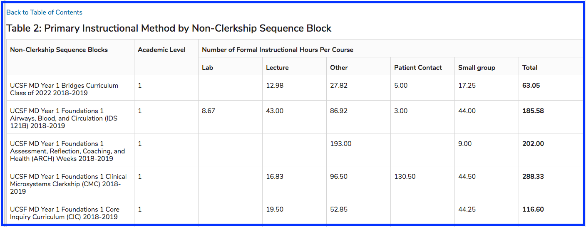
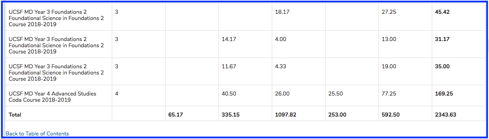

# Primary Instructional Method

As shown above, the bottom of this table contains a "Total" section, which sums up the hours of each instructional method. This preview view can be very helpful in case you may have forgotten to consider small groups to count as one offering, rather than multiple, which may overestimate the educational hours.