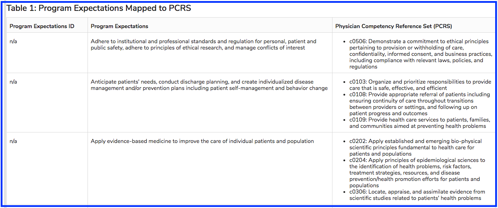

# Program Expectations Mapped to PCRS

Since this is a long table, the top portion is shown below.  

More information on PCRS is available [here](https://www.aamc.org/data-reports/curriculum-reports/interactive-data/competency-mapping-medical-school-program-expectations-mapped-physician-competency-reference-set).

All tables have a link to return the user to the Table of Contents. It appears as shown below.

  

