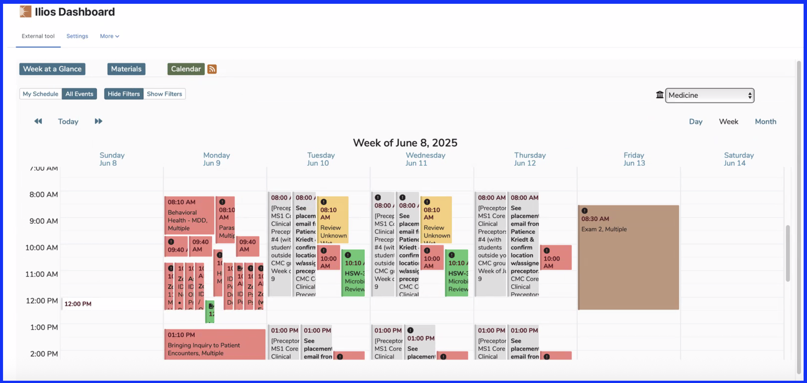

# LTI Integration

LTI refers to "Learning Tools Interoperability", a standard being rapidly adopted around the world to allow edTech systems to work together better.

In many cases, it will be desirable to have access to the Ilios calendar and learning material information within an external system, such as a learning management system (LMS). To facilitate this, we have an LTI plug-in that can be easily added to a wide range of different LMS systems. At UCSF, we add it to moodle. This can be done by choosing "Ilios Dashboard" as an activity within moodle.

## Deploying the Ilios LTI

Ilios now requires LTI, in order to plug the Ilios events & calendar dashboard directly into your LTI-compatible LMS pages. Once properly congigured, it's as easy as clicking your mouse (two or three times). Using the Ilios LTI component is significantly more effective for your users than adding either an external link to the Ilios application pages, or using the older embedded calendar app, which is no longer supported.

We host the LTI provider as a service to the education community. You can run it yourself or get in touch with us. We will help you with it and help you with the configuration after a few simple questions. 

We can host this for you. Please feel free to send any email inquiries [here](mailto:support@iliosproject.org). We'd be glad to help you configure LTI for your environment.

The screen shot below shows the LTI Dashboard embedded into the current UCSF LMS (Moodle).

<figure>
  
  <figcaption>
    
LTI Dashboard (embedded into Moodle LMS)

  </figcaption>
</figure>

The older `Calendar_Controller.php` file, which added the Ilios calendar as an iFrame to Moodle is no longer supported.
