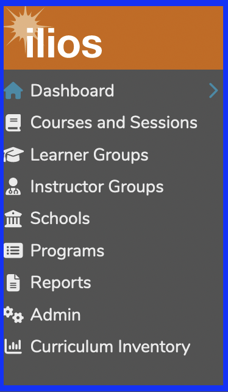
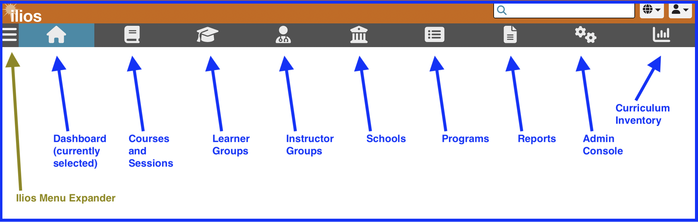
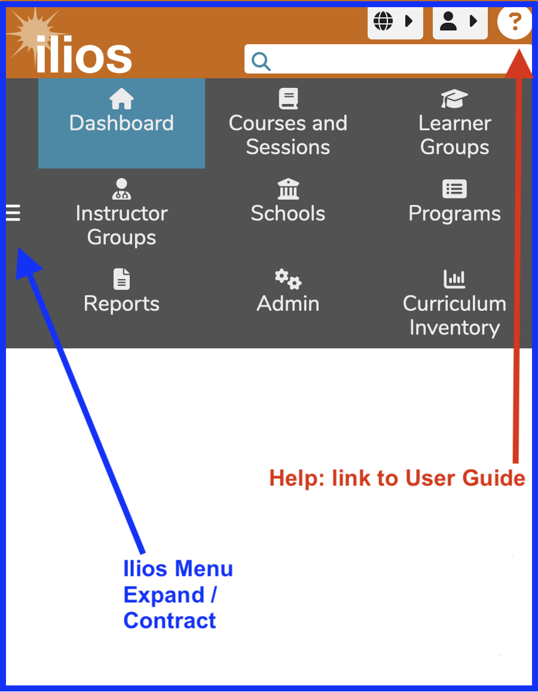

# Dashboard

Once logged in, you will be presented with the “Dashboard” or landing page, which will display the events for the current week for the logged-in user ([Week at a Glance](https://iliosproject.gitbook.io/ilios-user-guide/dashboard/week-at-a-glance)). Initially, the Calendar is not displayed. Clicking the "Calendar" button causes the Calendar to appear instead of Week at a Glance.

The Dashboard is designed to provide quick access to common sets of information and simple task and activity tracking. Navigation is performed by using the Ilios Menu, which appears on the upper left part of the screen and can be accessed and expanded by clicking “Ilios Menu” as shown below. It is a fly away menu that expands once it has been clicked and is available even if you have scrolled down the page. If your screen has enough viewable area, the **Ilios Menu** will appear automatically as shown below. Ilios users who do not perform non-learner activities (i.e. students who are not also Instructors) will not see the Ilios Menu shown below.

### Ilios Menu

#### Large Screen View

The view below is of the Ilios flyout menu on a relatively large screen. This is how it will appear for Admin users unless they use a smaller screen, tablet, or smart phone.

<figure>
  
  <figcaption>
      
Ilios Menu - full size

  </figcaption>
</figure>

#### Small Screen View - contracted

When the Ilios application is not being viewed at full size or is being viewed using a device with a smaller screen surface area, the toolbar spans across the top of the screen as shown below.

<figure>
  
  <figcaption>
    
Ilios Menu - small size (contracted)

  </figcaption>
</figure>

The **Ilios Menu expander** is only available in the smaller view of the toolbar. It is not needed in full-size mode.

#### Small Screen View - expanded

Clicking the Ilios Menu expander (or contractor if already expanded) reveals in more detail the available menu options. You can see this display below.

<figure>
  
  <figcaption>
    
Ilios Flyout Menu - small view (expanded)

  </figcaption>
</figure>

Available menu items in all views include:

* **Dashboard:** This is the default Home page. That is the current location selected.
* [**Courses and Sessions**](https://iliosproject.gitbook.io/ilios-user-guide/courses-and-sessions)**:** Displays a filterable list of all courses and sessions for the schools with which your name is associated in Ilios.
* [**Learner Groups**](https://iliosproject.gitbook.io/ilios-user-guide/learner-groups)**:** Maintain (add/modify) learner groups to which students must belong in order to get assigned session offerings.
* [**Instructor Groups**](https://iliosproject.gitbook.io/ilios-user-guide/instructor-groups)**:** Associate groups of Instructors with one or more Instructor groups which can be attached to offerings.
* [**Schools**](https://iliosproject.gitbook.io/ilios-user-guide/schools)**:** Maintain school-wide Competencies, Vocabularies, optional Session Attributes, and School Leadership.
* [**Programs**](https://iliosproject.gitbook.io/ilios-user-guide/programs)**:** Add or Modify program objects, including Program Years and their associated attributes.
* [**Reports**](https://iliosproject.gitbook.io/ilios-user-guide/reports)**:** Add, modify, or view user-specific customizable Reports.
* [**Admin**](https://iliosproject.gitbook.io/ilios-user-guide/admin)**:** Maintain Accounts and User Management, which includes Primary and Secondary Cohort assignment functionality. Instructors will not see this unless they have been granted administrative rights over their School or Program.
* **Curriculum Inventory**: (no longer supported by the AAMC) Create and maintain Curriculum Inventory reports.

Refer to the [Permissions Matrix](https://www.dropbox.com/s/431sdj2bfoi3v1f/Ilios%20New%20Default%20Permissions%20Matrix.pdf?dl=0) to determine how to assign rights to these functional areas within Ilios.

## Dashboard View Options

There are four different fully functional views that can be accessed from the Dashboard. Each of these is detailed in upcoming sections and can be accessed by clicking the links below. The default Dashboard view is Week at a Glance.

These Dashboard View Options are ...

* [**Week At A Glance** ](https://iliosproject.gitbook.io/ilios-user-guide/dashboard/week-at-a-glance)(default view)
* ****[**Materials**](https://iliosproject.gitbook.io/ilios-user-guide/dashboard/materials-view)****
* ****[**Calendar**](https://iliosproject.gitbook.io/ilios-user-guide/dashboard/calendar-view)****

Also available ...

* [**Global Search**](https://iliosproject.gitbook.io/ilios-user-guide/dashboard/search)

Also available in the upper right corner underneath the logged in user's name are the following ...

* [**My Profile**](https://iliosproject.gitbook.io/ilios-user-guide/dashboard/my-profile)
* **Logout** -- exits the application

To the left of the drop-down explained above is the Language Selector drop-down menu.

* [**Language Selector**](https://iliosproject.gitbook.io/ilios-user-guide/dashboard/language-selector)
