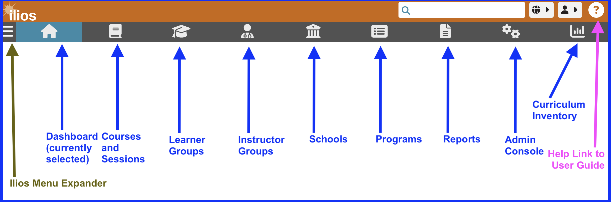

# Dashboard

Once logged in, you will be presented with the “Dashboard”, the landing page, which will display the events for the current week for the logged-in user ([Week at a Glance](https://iliosproject.gitbook.io/ilios-user-guide/dashboard/week-at-a-glance)). Other options available at the Dashboard level are [Materials](https://iliosproject.gitbook.io/ilios-user-guide/dashboard/materials-view) and [Calendar](https://iliosproject.gitbook.io/ilios-user-guide/dashboard/calendar-view) (along with the associated [Calendar Feed](https://iliosproject.gitbook.io/ilios-user-guide/dashboard/calendar-feed-options) button).

The Dashboard is designed to provide quick access to common sets of information and simple task and activity tracking. This is considered to be the "home" page in Ilios. Navigation is performed by using the Ilios Menu, which appears on the upper left part of the screen. It is a fly away menu that expands once it has been clicked and is available even if you have scrolled down the page. If your screen has enough viewable area, the **Ilios Navigation Menu** will appear automatically as shown below. 

**NOTE:** Ilios users who do not perform non-learner activities (i.e. students who have NOT been assigned the role of Instructor (by association to offerings), Course Director or Administrator, Session Administrator, or School-level permissions) will not see the Ilios Navigation Menu shown below. Student Advisors, if not provided a role with even higher permissions such as any of the ones mentioned above, also will not see the Ilios Navigation Menu.

## Ilios Navigation Menu

This refers to the menu found on the left of the screen in full screen viewing mode. Not all users will see this (explained in NOTE above). Its appearance varies with different screen sizes or devices. The navigational elements and destinations remain the same regardless of the user's view.

### Large Screen View
The view below is of the Ilios navigation menu on a relatively large screen. This is how it will appear for Admin users unless they use a smaller screen, tablet, or smart phone.

<figure>
  
  <figcaption>
      
menu - full size

  </figcaption>
</figure>

### Smaller Screen View - contracted

When the Ilios application is not being viewed at full size or is being viewed using a device with a smaller screen surface area, the toolbar spans across the top of the screen as shown below.

<figure>
  
  <figcaption>
    
menu - small size (contracted)

  </figcaption>
</figure>

The **Ilios Menu expander** is only available in the smaller view of the toolbar. It is not needed in full-size mode. The **Help Link** is always available and takes the user directly to this very guide.

### Smaller Screen View - expanded

Clicking the Ilios Menu expander (or contractor if already expanded) reveals in greater detail the available menu options or reduces them to their previous size if already expanded. You can see this display below after clicking to expand the menu.

<figure>
  
  <figcaption>
    
flyout menu - small view (expanded)

  </figcaption>
</figure>

### Mobile Screen View

The view of Ilios as seen from a mobile phone or device is very similar to the way it is described above in the Smaller Screen View sections (expanded or contracted).

For more details on viewing and using Ilios with handheld mobile devices like smart phones and tablets, review [Mobile Devices](https://iliosproject.gitbook.io/ilios-user-guide/dashboard/mobile-devices).

### Menu Items (all views)

These menu items available in all views include:

* **Dashboard:** This is the default Home page. That is the current location selected.
* [**Courses and Sessions**](https://iliosproject.gitbook.io/ilios-user-guide/courses-and-sessions)**:** Maintain (add/modify) Courses and Sessions. Select from a filterable list of all courses and sessions for the school(s) with which your user profile is associated in Ilios.
* [**Learner Groups**](https://iliosproject.gitbook.io/ilios-user-guide/learner-groups)**:** Maintain (add/modify) learner groups to which students must belong in order to get assigned session offerings.
* [**Instructor Groups**](https://iliosproject.gitbook.io/ilios-user-guide/instructor-groups)**:** Associate groups of Instructors with one or more Instructor groups which can be attached to offerings.
* [**Schools**](https://iliosproject.gitbook.io/ilios-user-guide/schools)**:** Maintain school-wide Leadership, Competencies, Vocabularies, Session Types, optional Session Attributes, Email Contacts, and Institutional Information.
* [**Programs**](https://iliosproject.gitbook.io/ilios-user-guide/programs)**:** Add or Modify program objects, including Program Years and their associated attributes.
* [**Reports**](https://iliosproject.gitbook.io/ilios-user-guide/reports)**:** Add, modify, or view user-specific customizable Reports: available [Subject](https://iliosproject.gitbook.io/ilios-user-guide/reports/subject_reports) and [Curriculum](https://iliosproject.gitbook.io/ilios-user-guide/reports/curriculum_reports) reports.
* [**Admin**](https://iliosproject.gitbook.io/ilios-user-guide/admin)**:** Maintain Accounts and User Management, which includes Primary and Secondary Cohort assignment functionality. Instructors will not see this unless they have been granted administrative rights over their School or Program.
* **Curriculum Inventory**: (no longer supported by the AAMC) Create and maintain Curriculum Inventory reports.

Refer to the [Permissions Matrix](https://www.dropbox.com/s/431sdj2bfoi3v1f/Ilios%20New%20Default%20Permissions%20Matrix.pdf?dl=0) to determine how to assign rights to these functional areas within Ilios.

## Dashboard View Options

There are three different fully functional views that can be accessed from the Dashboard. Each of these is detailed in upcoming sections and can be accessed by clicking the links below. The default Dashboard view is Week at a Glance.

These Dashboard View Options are ...

* [**Week At A Glance**](https://iliosproject.gitbook.io/ilios-user-guide/dashboard/week-at-a-glance) (default view)
* [**Materials**](https://iliosproject.gitbook.io/ilios-user-guide/dashboard/materials-view)
* [**Calendar**](https://iliosproject.gitbook.io/ilios-user-guide/dashboard/calendar-view)

### High Level Options

These are available from anywhere in Ilios at the top of the screen.

* [**Global Search**](https://iliosproject.gitbook.io/ilios-user-guide/dashboard/search)
* [**Language Selector**](https://iliosproject.gitbook.io/ilios-user-guide/dashboard/language-selector)

------------------------------------------

### User Menu Options

These refere to menu actions available underneath the logged in user's name and are also available from anywhere in Ilios.

* [**My Profile**](https://iliosproject.gitbook.io/ilios-user-guide/dashboard/my-profile)
* **Logout** -- exits the application

<figure>
  
  <figcaption>
      
user menu options displayed

  </figcaption>
</figure>

-----------------------------------------

* **Help link** -- link to this user guide - Even further over to the right of the screen is a "Help" link to this very same user guide. This is available in any screen size and from any location within Ilios. 

<figure>
  
  <figcaption>
      
Help - link to user guide

  </figcaption>
</figure>

