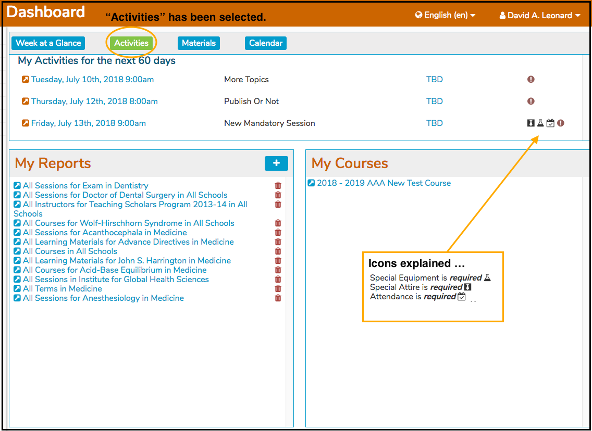

# Activities View

When you want to see more than one week at a time, "Activities" can be selected. This will display all learning activities for the next 60 days.

## Activities \(for the next 60 days\)

* Displays all upcoming activities for the logged in user - student or non-student. Either the Date/Time can be clicked or the Room \# can be clicked.  Like always, links have the blue font and the mouse pointer turns to a finger.  You will be taken to the [Event Detail](https://iliosproject.gitbook.io/ilios-user-guide/dashboard/calendar-view#event-detail-view) page upon clicking on one of the "Activities" links.

