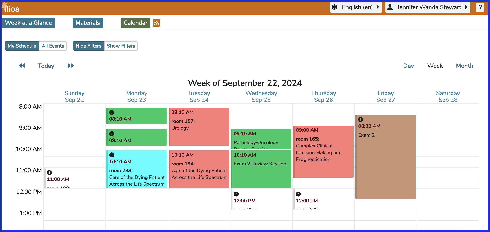

## Student-Only View 

The screen shot below shows what a typical student would see after clicking "Calendar" from the Dashboard. This student has not been assigned any teaching or administrative roles in Ilios yet. If their record were retrieved from the Admin Console by a user with more advanced privileges, the "Performs Non-Learner Functions" would be set to "No" by the system. They do not see the Ilios flyout menu or the Event View Settings toolbar until they have been assigned non-learner activities in Ilios. 

