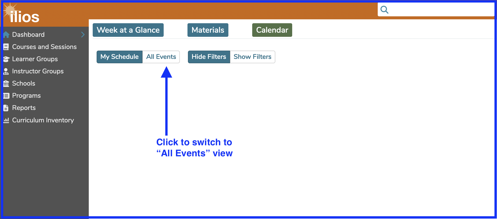
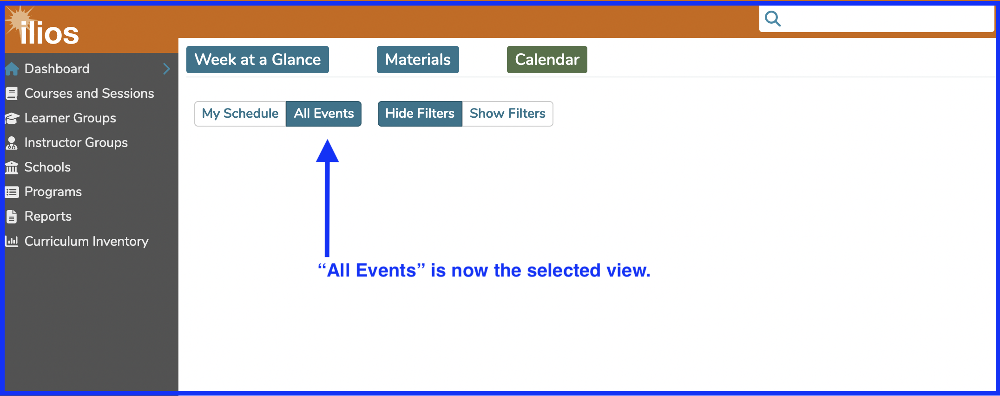

This displays results from the entire curriculum of the given school from any and all academic years (school events). To get to different academic years which might even overlap in calendar years, switch to "Month" view and scroll backwards or forwards in time using the buttons provided.

Below is a screenshot from a typical day showing the full School of Medicine schedule in each of the three duration views.

To switch to "All Events", click as shown below.

As seen below, "All Events" is now selected.

