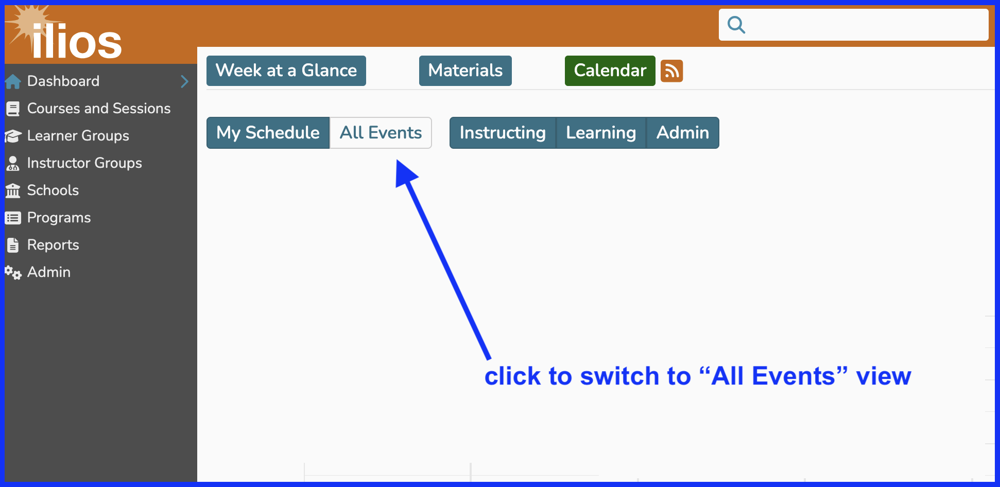
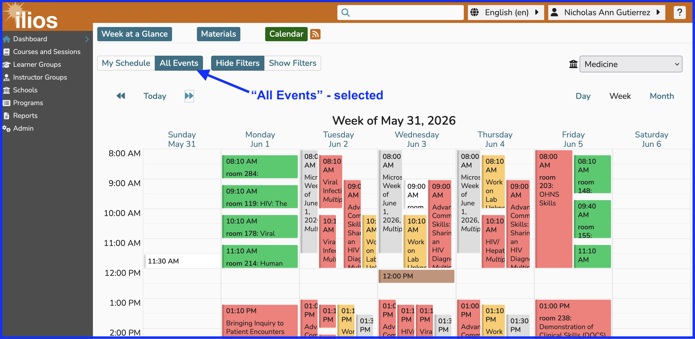

This displays results from the entire curriculum of the selected school from any and all academic years (school events). To get to different academic years which might overlap in calendar years, switch to "Month" view and scroll backwards or forwards in time using the buttons provided.

To switch to the "All Events" view, click as shown below.

As seen below, "All Events" is now selected.

