# Calendar Feed Options

There are two methods of accessing your Ilios Calendar on a mobile device ...

1. Use the Ilios application directly on your phone or other mobile device.
2. Generate a URL Feed and add it to a calendar application of your choosing on your phone or other mobile device.

A [mobile friendly version](https://iliosproject.gitbook.io/ilios-user-guide/dashboard/mobile-devices) of the Ilios application has been developed and is available now.

If you are using form-based authentication, Ilios can be added (at least in Chrome) as an application to run on its own.

That having been said, there are two ways to obtain all of your Ilios curricular information onto your phone. Those methods are covered in the next two sections.

## Quick Links

* Generate a URL Feed (below)
  * [Add Calendar to MS Outlook](https://iliosproject.gitbook.io/ilios-user-guide/dashboard/calendar-feed-options#add-calendar-to-ms-outlook)
  * [Add Calendar to Office 365 Outlook](https://iliosproject.gitbook.io/ilios-user-guide/dashboard/calendar-feed-options#add-calendar-to-office-365-outlook)
  * [Add Calendar to Google Calendar](https://iliosproject.gitbook.io/ilios-user-guide/dashboard/calendar-feed-options#add-calendar-to-google-calendar)
  * [Feed Date Range](https://iliosproject.gitbook.io/ilios-user-guide/dashboard/calendar-feed-options#feed-date-range)
* [LTI Integration](https://iliosproject.gitbook.io/ilios-user-guide/dashboard/calendar-feed-options#lti-integration)
* [Mobile Device View](https://iliosproject.gitbook.io/ilios-user-guide/dashboard/mobile-devices)

## Generate a URL Feed

Ilios provides users with synchronized calendar access, via URL. This allows real time embedding and synchronization of a user’s Ilios calendar with mobile appliance calendars, Google calendar, and any other web-enabled calendar system which allows external calendars to be added via URL.

To connect a calendar application with Ilios, you will need a unique URL that you can copy and paste into the other calendar application. To get one, follow the steps below and then copy that URL into your calendar application of choice.

**NOTE:** The Calendar feed includes data which spans the time frame of 4 months prior to the current date until two months after the current date. Calendar items that fall outside of that time range or that are in Draft mode will not appear in the feed.

**Step One:** Make sure to select Calendar and then click the Feed icon to generate the Calendar's URL feed.

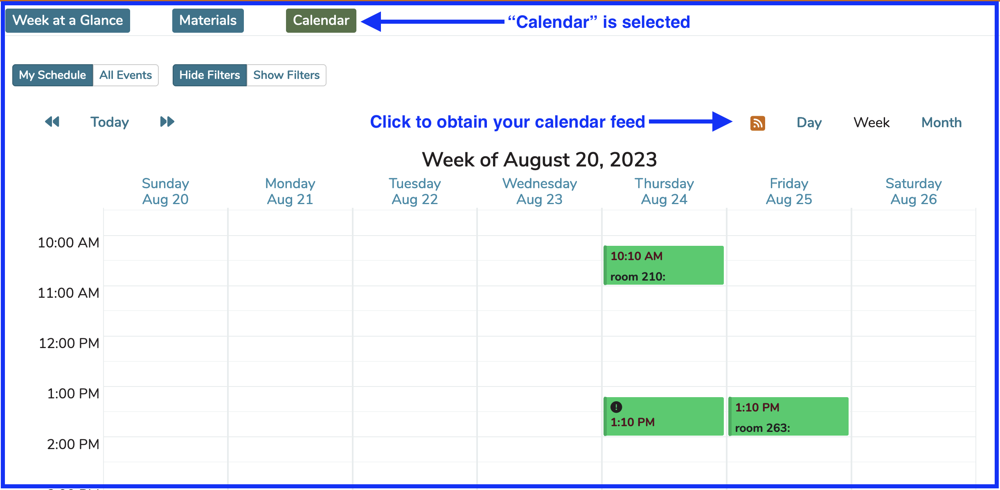

**Step Two:** Copy the Feed to your clipboard by clicking the button shown below or close and return to the Calendar Dashboard.

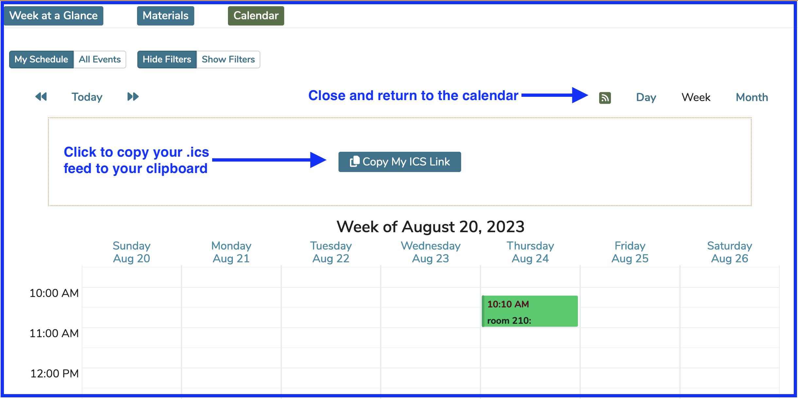

A temporary confirmation "Copied Successfully" message will appear as shown below. It disappears on its own shortly.

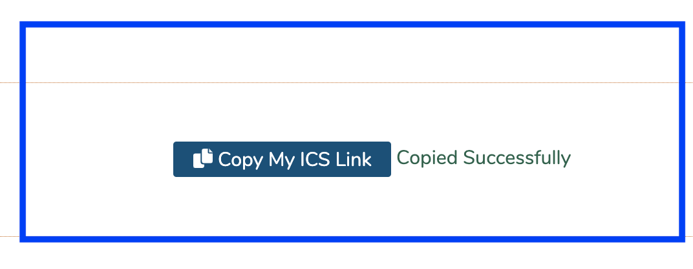

**NOTE:** The URL generated for this is like a password. Anyone who knows it can view your calendar! Keep it safe.

It is also important to note that if you are going to use this feed on a smart phone, it is recommended to paste the URL directly into the phone rather "daisy chaining" from yet another third party application. This can introduce additional problems when more than one synched application may have to update the feed, causing out of date information to be displayed.

This URL can be entered into any calendaring system that allows the addition of calendars by URL. Inserting the Calendar Feed into Microsoft Outlook and gMail are covered in the following sections.

### Feed Date Range

The date range of the feed is currently two months forward and four months backwards. This was a result of the best combination of speed and functionality we could find. Longer feeds were too slow to load. Shorter feeds did not provide enough data. This is our current compromise.

### Add Calendar To MS Outlook

After following the steps in the previous section, it is easy to add the Calendar to Microsoft's Outlook email system.

Simply ...

* Open Outlook
* Click Calendar
* Right Click on either "My Calendars" or "Other Calendars".  This is according to your preference.  Both locations allow the addition of a URL feed calendar.
* From there, click on "Add Calendar" and then "From Internet"
*   When the following box appears, paste in the URL copied in the previous step.

    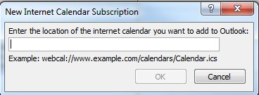
* Click "OK" to add the Calendar feed.
*   Once pasted and added, the following box appears.

    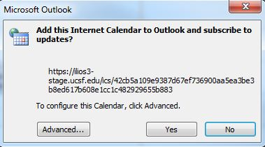
* Click "Yes".
*   It appears as shown below.

    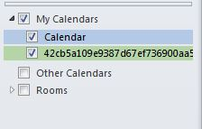
* This is not a very easy name to remember so you will probably want to change it to something more useful like "Ilios" or "Classes" or whatever you feel is appropriate.
* Just right-click on the long, ugly name and rename it.
*   The results of doing this are shown below.  In this example, it was renamed "UCSF Classes".

    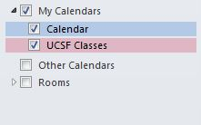

### Add Calendar to Office 365 Outlook

This will be demonstrated showing the web version of Outlook from the Microsoft Office 365 Suite. After generating the URL calendar feed as described in the "Generate URL Feed" section at the top of this chapter, the steps are pretty straightforward.

* Log in to the Office 365 Outlook web client
* Click as shown below to start this process

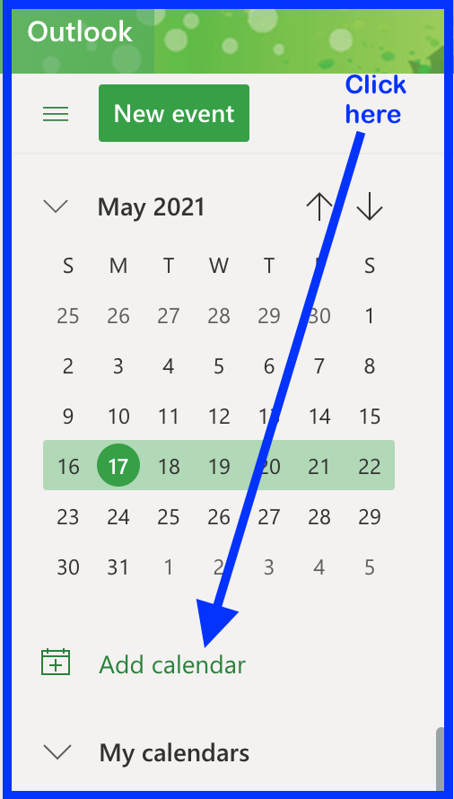

* Click to subscribe to the calendar from the web

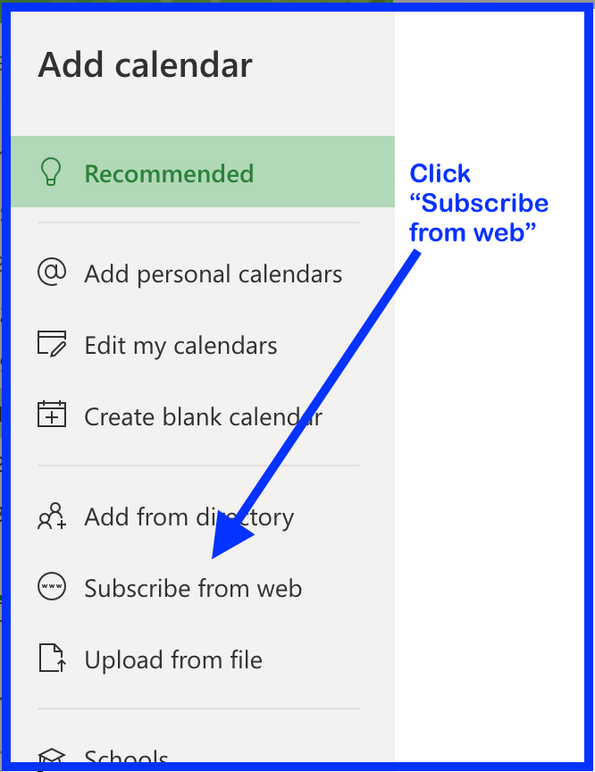

* This next step assumes that you already have the .ics feed copied up to your clipboard. Do this if you have not done so already.
* Paste the .ics feed into the provided field as shown below.
* Change the name of calendar to something memorable.
* Choose the location to place this newly created calendar.
* Other options include selecting a color scheme or "charm", which didn't seem to have much of an effect during my testing or documentation so accepting the defaults might serve your needs. See screen shot below for details.

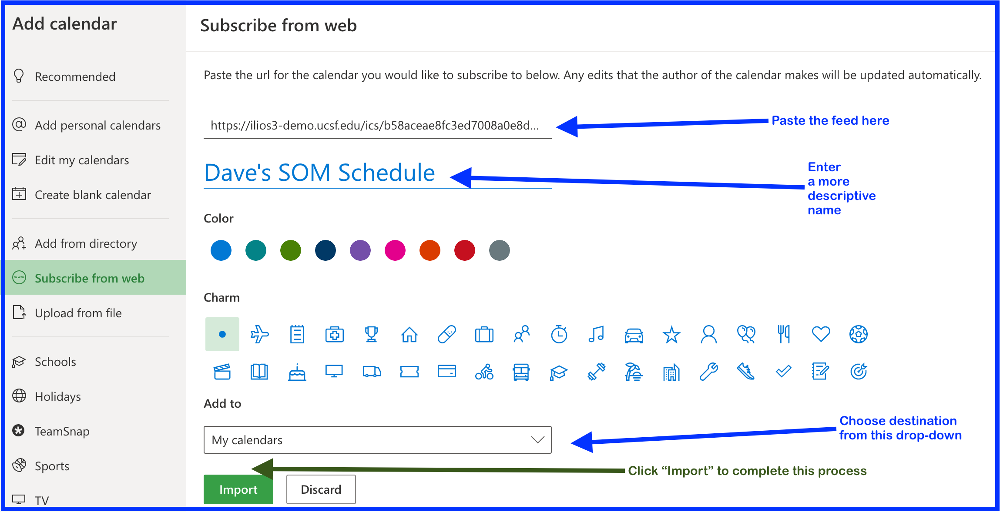

* Once "Import" has been clicked and the process has been completed, close the modal window and your screen will appear something like the following ...

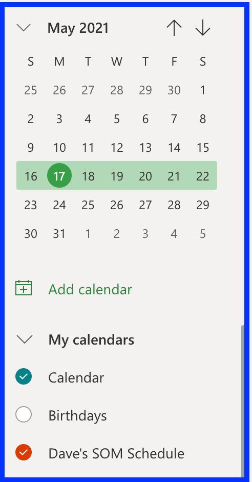

### Add Calendar to Google Calendar

The process for adding the Calendar feed to a Google (or other) mail account is similar to the process of adding the Calendar feed to an Outlook Calendar. If using a laptop or desktop computer, you can just paste the URL into the location specified. It is still a matter of adding a Calendar from the Internet, and pasting the URL into the location indicated.

You may wish to email the URL to yourself if you want to set this up using your smart phone instead of a computer.

### Event Detail 

Event Detail is available from the calendar feed (well it's linked anyway). Clicking on an event inside your calendar feed brings up a screen similar to the following. In this case, one of the optional session attributes (Attendance Required) has been selected for this event. Any user (but especially for students) viewing and using their calendar feed will be alerted of the fact that they are required to attend this event. This information is contained in the Description section located directly below the Session Type.

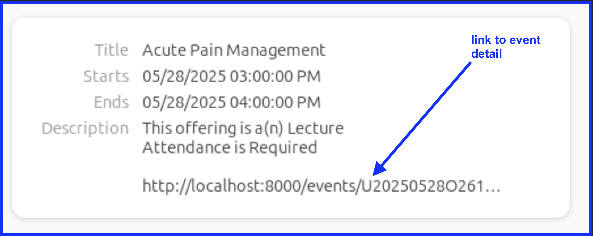

## LTI Integration

LTI refers to "Learning Tools Interoperability", a standard being rapidly adopted around the world to allow edTech systems to work together better.

In many cases, it will be desirable to have access to the Ilios calendar and learning material information within an external system, such as a learning management system (LMS). To facilitate this, we have an LTI plug-in that can be easily added to a wide range of different LMS systems. At UCSF, we add it to moodle. This can be done by choosing "Ilios Dashboard" as an activity within moodle.

### Deploying the Ilios LTI

Ilios now requires LTI, in order to plug the Ilios events & calendar dashboard directly into your LTI-compatible LMS pages. It's as easy as clicking your mouse (two or three times). Using the Ilios LTI component is significantly more effective for your users than adding either an external link to the Ilios application pages, or using the older embedded calendar app. And besides, after the start of the new year, only the LTI component will function.

The Ilios code is contained in a separate GitHub repository. It can be easily implemented. 

The older `Calendar_Controller.php` file, which added the Ilios calendar as an iFrame to moodle is no longer supported.
