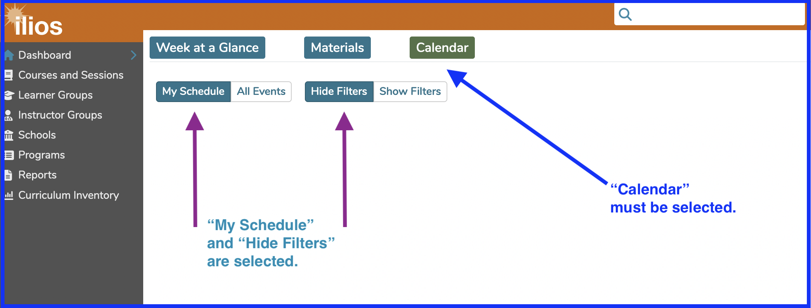
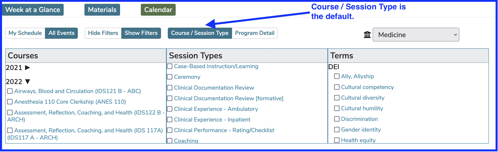
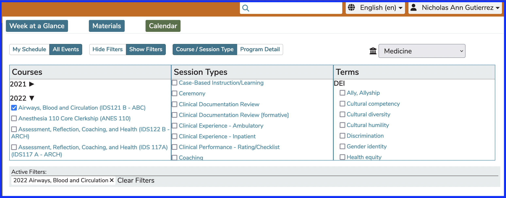
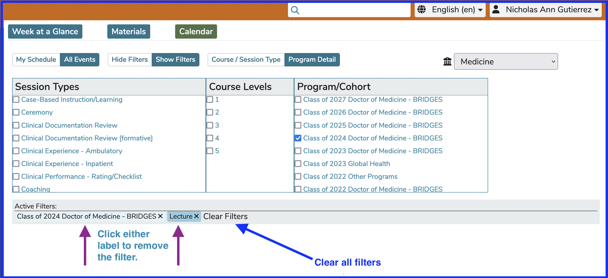
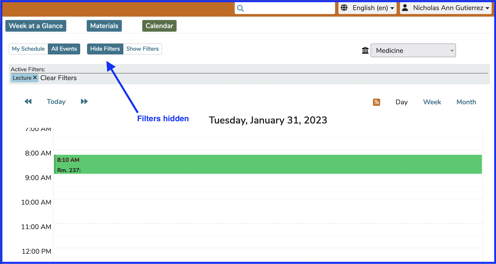

## Calendar Search/Filter

The calendar is populated based on the choice made by the user choosing between the buttons located on top of the calendar itself. Initially "My Schedule" and "Hide Filters" are the two selections made by default. This can be easily switched to "All Events" to see all activity in the selected school.

**Note about Buttons:** The button highlighted in green background with white font shows the active selection. The button with the grey background and font is the other option that can be selected. display the state that is currently activated. Clicking on a Toggle will switch the toggle to another setting. The slider could be on either side.

Regardless of whether you are displaying All Events or My Schedule, there are two methods of searching (**“Search By Topic/Detail”** and **“Search By Course”**).

Switching from one to the other is accomplished by clicking the correct button. The text of the toggle switches back and forth depending on which search is currently active.

## My Schedule

This displays only those results which are available within the user’s current schedule. This is the default view. To get to "All Events" click the My Schedule toggle to change it to All Events as shown below. The My Schedule view will display all of the learning events to which the logged in user is associated. Learners (students) will see only the offerings that they are scheduled to attend. The view an Instructors will see is only the Offerings they are assigned as Instructor to teach.

**Important Note:** Course Directors and Course Administrators can choose between seeing all of the Offerings for the Courses they are assigned to as Course Directors or Administrators and seeing only the offerings for which they have been assigned as an Instructor.

Student Advisors will **NOT** see all of the Offerings initially. They are encouraged to use the filters and / or Courses and Sessions screen to review the Offerings in the Course(s) for which they have been assigned the Student Advisor role.

## Search Options

By default, the filters needed to perform a search on the calendar are not activated. Us the (Show Filters/Hide Filters) Toggle to activate them.

It may be helpful to also toggle to view "All Events" (as shown above) rather than just filtering your own schedule.

To activate the Filters ...

The toggles now appear as shown below with the filters activated and visible.

### Search By Course / Session Type

This search option allows the user to search and display all of the activities for any course in the selected academic year and school. That course selection can be further filtered for specific session types.

Search is possible by each of the following, or any combination of the following categories of data:

* **Courses (pertaining to a chosen Program Year)**
* **Session Types**
* **[**Terms (by Vocabularies)**](https://iliosproject.gitbook.io/ilios-user-guide/schools/vocabularies)**

In order to see all of the Sessions related to the Airways, Blood, and Circulation Course (any type of Session), the check boxes can be used as shown below.

In any of these search modes, a search is automatically performed once the corresponding check boxes have been selected. The Calendar will reload with the results.

### Search By Program Detail

Switch to a "Program Detail" search as shown below.

This search option allows the user to search and display all activities for any course in the selected academic year and school, which have the selected search attributes. Search is possible by each of the following, or any combination of the following categories of data:

* **Session Types**
* **Course Levels**
* **Program/Cohort**

In order to see all of the Lectures (Session Type) for the Class of 2024 Doctor of Medicine - BRIDGES (Program/Cohort), the check boxes can be used as shown below.

### Load Filters Based On School

The Course List and Program/Cohort List in the filters is determined by the value selected in the School Selector drop-down (if applicable), which is available only in "All Events" mode and only if you have access to more than one school. 

In "My Schedule" mode, there is no need to use this because your schedule will appear with events displayed from any applicable school. Only the courses or program/cohorts associated with the selected School will be available for filtering selection. 

**Flexibility:** It is possible to select a Course from any selected year along with other selecatable criteria and then go select one or more courses from another Academic Year or School if that is what you want to do. All results will be displayed on the calendar for review.

Detailed information is available for all search results on the calendar, however: learning materials for which the user does not already have access privileges will be visible (file name and info) but will not be downloadable. Click on any calendared event to get to  to review any of the offerings or ILM's.

The detail panel displayed in Event Detail provides access to offering details of time, place, date, and instructor; course and session Objectives, associated learning materials, and the session description. 

### Hiding the Filters

**QUICK NOTE:** You can apply filters and then hide the filter selectors. This will free up viewable Calendar area but still maintain the filtering criteria. An example of this is shown below. The active filter is "Lecture".

### Expert Tip

It is also possible to combine filters between the two filter types. In other words, you can use the "Course / Type" filter, add one or more criteria, and then use the "Details" filter, adding more criteria from there. You can do a combination filter from both filter types.

## Duration Options

You can specify that a calendar be displayed in Day, Week, or Month viewing modes.

### Week View

Since this is the default view, let's show this one first: 

Options selected here ...

Option One - `All Events` 
Option Two - `Hide Filters` 
Option Three - School of Medicine has been selected from the drop-down. If you (like many Ilios users) have access to only one school, your school will be there automatically and the drop-down will not appear.

