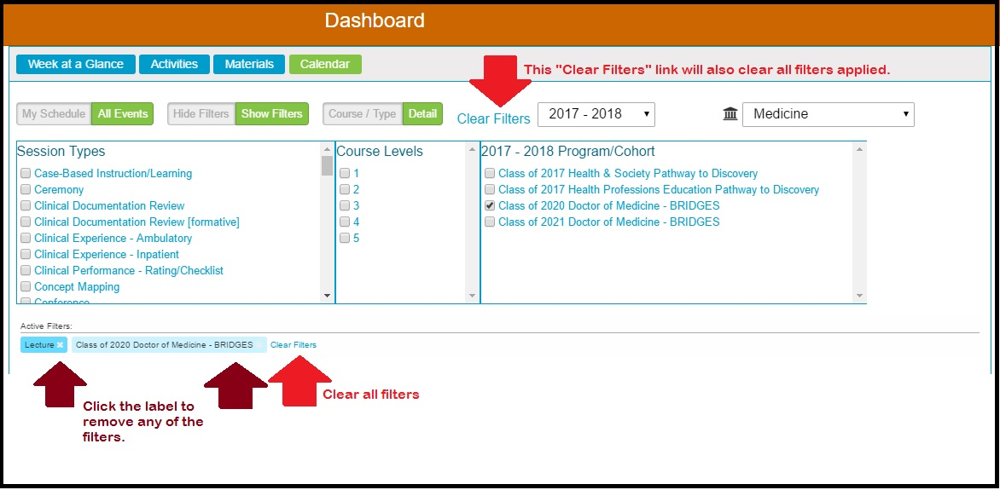

# Calendar Search & Filter Options

## Calendar Search/Filter

This functionality is available to all users in all modes of view. It provides the ability to review and filter the curriculum that has been published to the calendar in a number of different ways.

The calendar is populated based on the choice made by the user choosing between the buttons located on top of the calendar itself. Initially "My Schedule" and "Hide Filters" are the two selections made by default.

_**All Events**_ will search and display results from the entire curriculum of the given school from any academic year.

_**My Schedule**_ will display only those results which are available within the user’s current schedule. This is the default view. To get to "All Events" click the My Schedule toggle to change it to All Events as shown below. The My Schedule view will display all of the learning events to which the logged in user is associated. Learners \(students\) will see only the offerings that they are scheduled to attend. The view an Instructors will see is only the Offerings they are assigned as Instructor to teach. 

**Important Note:** Course Directors will see all of the Offerings for the Courses they assigned to as Course Directors; however Course Administrators and Student Advisors will **NOT** see all of the Offerings initially. They are encouraged to use the filters and / or Courses and Sessions screen to review the Offerings in the Course\(s\) for which they have been assigned the Course Administrator or Student Advisor role.

To switch to "All Events", click as shown below.

As seen below, "All Events" is now selected.

_**Note about Buttons:**_ The button highlighted in green background with white font shows the active selection. The button with the grey background and font is the other option that can be selected. display the state that is currently activated. Clicking on a Toggle will switch the toggle to another setting. The slider could be on either side.

Regardless of whether you are displaying All Events of My Schedule, there are two methods of searching \(_**“Search By Topic/Detail”**_ and _**“Search By Course”**_\).  
Switching from one to the other is accomplished by clicking the correct button. The text of the toggle switches back and forth depending on which search is currently active.

### Search Options

By default, the filters needed to perform a search on the calendar are not activated. Us the \(Show Filters/Hide Filters\) Toggle to activate them.

It may be helpful to also toggle to view "All Events" \(as shown above\) rather than just filtering your own schedule.

To activate the Filters ...

The toggles now appear as shown below with the filters activated and visible.

#### Search By Course/Type

This search option allows the user to search and display all of the activities for any course in the selected academic year and school. That course selection can be further filtered for specific session types.

Search is possible by each of the following, or any combination of the following categories of data:

* **Courses \(pertaining to a chosen Program Year\)** 
* **Session Types**

In order to see all of the Sessions related to the Brain, Mind, and Behavior Course \(any type of Session\), the check boxes can be used as shown below.

In any of these search modes, a search is automatically performed once the corresponding check boxes have been selected. The Calendar will reload with the results.

#### Search By Detail

Switch to a "Detail" search as shown below.

This search option allows the user to search and display all activities for any course in the selected academic year and school, which have the selected search attributes. Search is possible by each of the following, or any combination of the following categories of data:

* **Topics** 
* **Session Types**
* **Course Levels**
* **Program/Cohort**

In order to see all of the Lectures \(Session Type\) for the Class of 2020 Doctor of Medicine - BRIDGES \(Program/Cohort\), the check boxes can be used as shown below.

#### Load Filters Based On Academic Year & School

The Course List and Program/Cohort List in the filters are associated with the selection in the Academic Year Selector shown below. The lists may also be determined by the School Selector \(if applicable\), which is to the right of the Academic Year Selector. Only the courses or program/cohorts associated with the selected Academic Year \(and School\) will be available for filtering selection. This does not necessarily mean that the Course doesn't extend forward or backwards into a different Calendar or Educational year. _This drop-down only and specifically controls the lists of courses and cohorts available for filtering --- not the display of information on the calendar itself, which will always show events for all available stretches of time._

**Flexibility:** It is possible to select a Course or Session Type from 2015-16 and then go select one from another Academic Year \(2016-17\) or School if that is what you want to do.

Detailed information is available for all search results on the calendar, however: learning materials for which the user does not already have access privileges will be visible \(file name and info\) but will not be downloadable.

The detail panel provides access to offering details of time, place, date, and instructor; course and session Objectives, associated learning materials, and the session description. Clicking on the Show Course Summary link at the upper right of the detail panel will open a complete listing of all sessions and their details for the entire course, including learning materials.

The option is available to provide visual change alerts for calendar events. If activated in the Ilios configurations file for an institution, the alerts add a small icon to the upper left of any calendar event \(day and week view only\), as well as to its agenda list item listing whenever there has been an addition or update for that event. The icon would display for a set number of days after the change \(configurable value, currently set to 3 days; system default was 7 days\). After that, the event display returns to normal.

#### Hiding the Filters

**QUICK NOTE:** You can apply filters and then hide the filter selectors. This will free up viewable Calendar area but still maintain the filtering criteria. An example of this is shown below. The active filter is "Lecture".

#### Expert Tip

It is also possible to combine filters between the two filter types. In other words, you can use the "Course / Type" filter, add one or more criteria, and then use the "Details" filter, adding more criteria from there. You can do a combination filter from both filter types.

