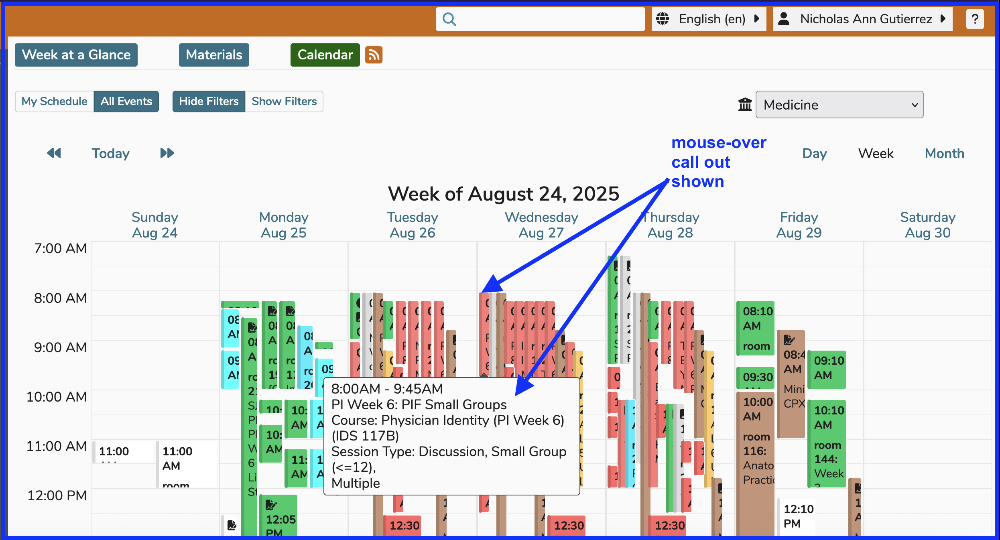

# Calendar View Options

Beyond the filtering options mentioned in the previous section, there are three different viewing options for the Calendar. These involve how much data you would like to view at once in terms of duration of time. The Calendar can be viewed based on the following time increments -- **Day, Week, Month**.

The Day, Week, and Month indicators (shown below) are used to switch between these time-based views.

## Week View

Since this is the default view, let's show this one first: 

Options selected here ...

Option One - `All Events` 
Option Two - `Hide Filters` 
Option Three - School of Medicine has been selected from the drop-down. If you (like many Ilios users) have access to only one school, your school will be there automatically and the drop-down will not appear.

To get to the Week View, click the "Week" Calendar View Switcher link. The screen will appear as shown below with all of the details for the selected week displayed. You can see all of the details for the selected week and the view starts initially at the time of the first offering for viewing simplicity. If there are no offerings at all, the calendar starts with 6:00 AM. The entire 24 hour day is available by scrolling up or down. In Ilios, weeks start with Sunday as the first day and end with the following Saturday - the last day of the week.

## Month View

To get to the Month View, click the "Month" Calendar View Switcher link. The screen will appear as shown below with all of the details for the entire selected month displayed.

## Day View

To get to the Day View, click the "Day" Calendar View Switcher link. The screen will appear as shown below with all of the details for the selected day displayed. You can see all of the details for the selected day. The view starts initially at the time of the first daily offering or at 6:00 AM if there are no assigned offerings. The entire 24 hour day is available by scrolling up or down.

### Multiple Offerings Display

When a Session with multiple offerings is clicked on the Week or Month View, the Day View is displayed to reveal the details.

For a Session with Multiple Offerings, it is important to note that the offerings will be grouped on the Calendar and only displayed once in Week and Month view. The Day view will show all of the Session Offerings on the same screen - as shown below.

**Click the Session with Multiple Offerings**

### Day View (Multiple Offerings)

All Offerings are displayed.

## Week View / Month View (Multiple Offerings)

With the Week View as well as the Month View, the Events will be rolled up into one with the rooms to be listed as "Multiple" and the Instructors' names will be listed such as "Instructor One, Instructor Two, et al".

An example of this display in a week view setting is shown below.

## Multi-day Events

Events that occur starting on one date and then ending on a later date are displayed below the Calendar. An example is shown below.

### Creating a Multi-day Event

Once the multi-day event has been saved in Ilios, the start and end date / times are populated automatically as shown above.

### Viewing a Multi-day Event

This appears underneath the Calendar when any event spans more than one day.

