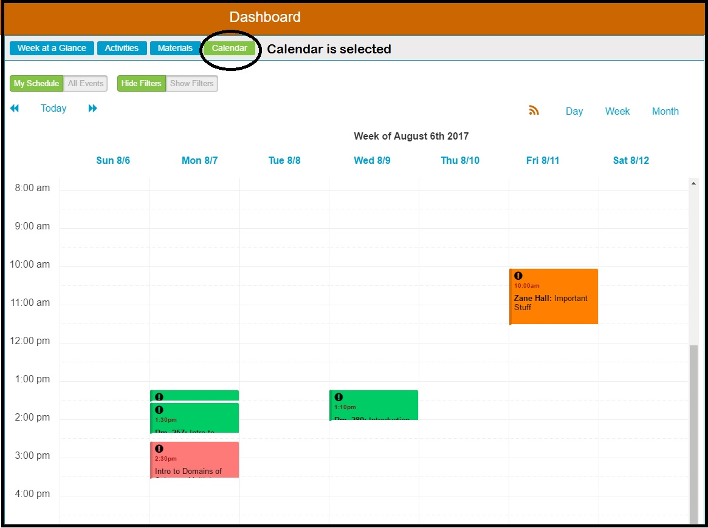
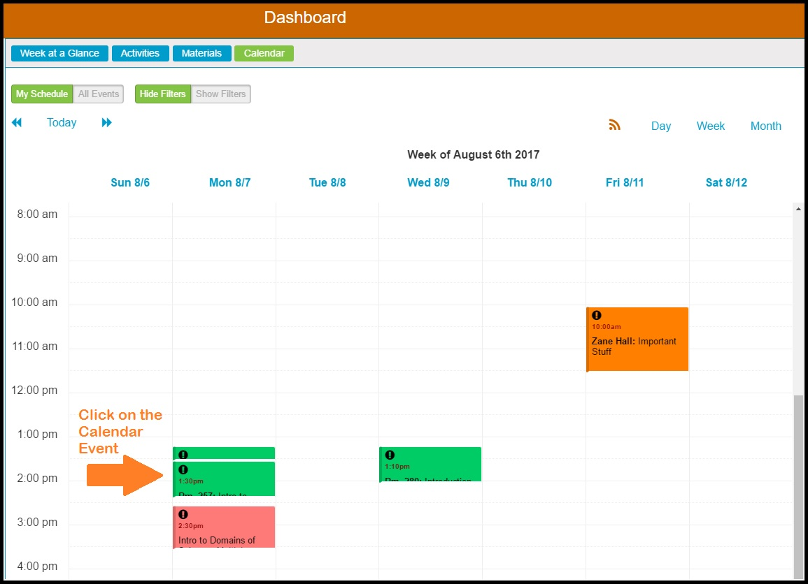
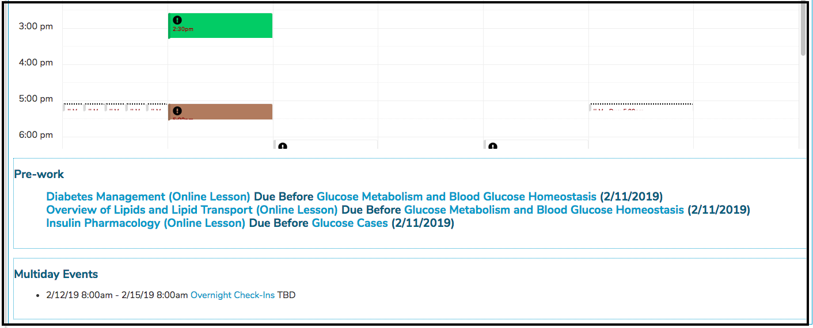
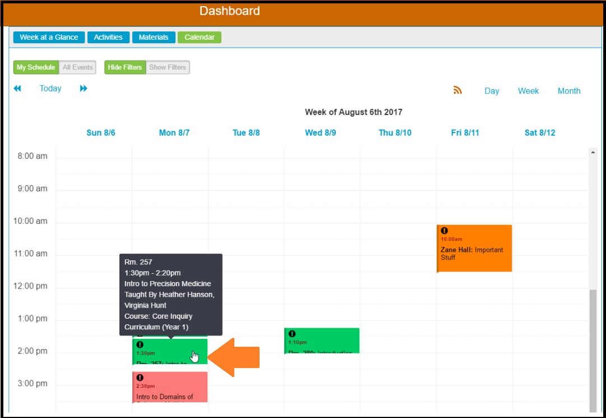

# Calendar View

### Calendar

Switching to the Calendar by clicking the Calendar button as shown above will cause the window to display as shown above. The Calendar becomes visible and enabled.

The Ilios calendar displays all items in Ilios with which you are directly associated. Clicking on an event in the calendar will bring up the Event Detail View for that specific Session Offering.

The scheduling and review of offerings can be accomplished by selecting "Courses and Sessions" from the Ilios menu. Although the scheduling of the offerings / events occurs on this screen, the event itself will appear on the Calendar at the corresponding date / time. These events will also be displayed in any linked calendars.

### Calendar View

### Pre-work / Multiday Events

ILM's that are linked to Sessions \(Pre-work\) are displayed below the Calendar in their own area. Multiday Events \(those that start and end on a different day\) are as well. See below for an example of this. 

### Event Detail View

After performing the click event shown above, the [event detail](https://iliosproject.gitbook.io/ilios-user-guide/dashboard/event-detail-view) view appears. 

### Additional Details

You can also hover over an event with your mouse to retrieve and display more details pertaining to that event without having to leave the Calendar.

### Color Coding

The Calendar display presents Session Offerings with different background colors. These colors indicate the type of learning activity for the Offering. These colors can be customized in Ilios. They are configurable at the school level.

[Session Types](https://iliosproject.gitbook.io/ilios-user-guide/schools/session-types) can be customized. 

### CSS Override

With the advent of Ilios 3.x, the application is served up from the front end. This means that overriding the CSS and performing CSS customizations is not currently supported but may be at a later date.

## Accessing Learning Materials via Calendar Feed

The ability to access specific learning materials via the calendar feed uses a similar system. A unique and encrypted token or "pseudo-key" is created for each available item within your calendar feed, which allows you to directly access that file. This is a similar mechanism to that used by tools such as Google Drive, Dropbox, Box, and other cloud storage systems. The encrypted pseudo-key for a learning material or file may only be accessed via the secure calendar feed, which in turn may only be generated from within the secure access login of Ilios. Like any such token, and like the feed URL itself, this link to the learning materials is again like a password and should not be shared indiscriminately. The providing of file access to the calendar feed follows the same business rules as Ilios in general. But as with any materials provided to users, once downloaded or shared, it is up to the user to protect that material from misuse.

See [Feed Options](https://iliosproject.gitbook.io/ilios-user-guide/dashboard/calendar-feed-options) for more details on setting this up.

## Protected information \(eg. PII, ePHI etc.\)

This type of confidential and personal information should not be stored in Ilios.

In the initial iteration of this feature, there is no interface for removing, regenerating, or reviewing the pseudo-key for learning materials.

This key is stored in the `learning_material` table, as the value `token`. Removing this value from a record in the database will make it inaccessible for download from the feed. Currently, this may be done by request to the Ilios technical support team. Unless it is certain that materials should **NOT** be accessible to students, this is not recommended.

