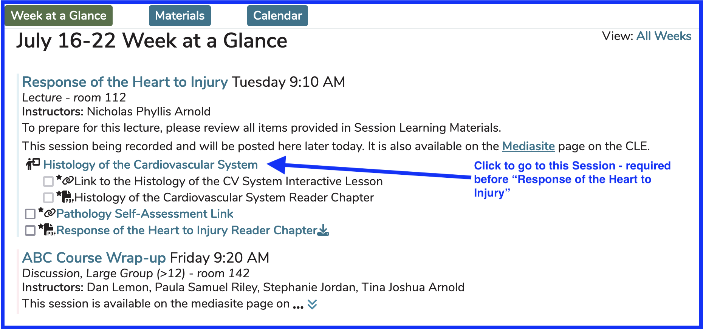
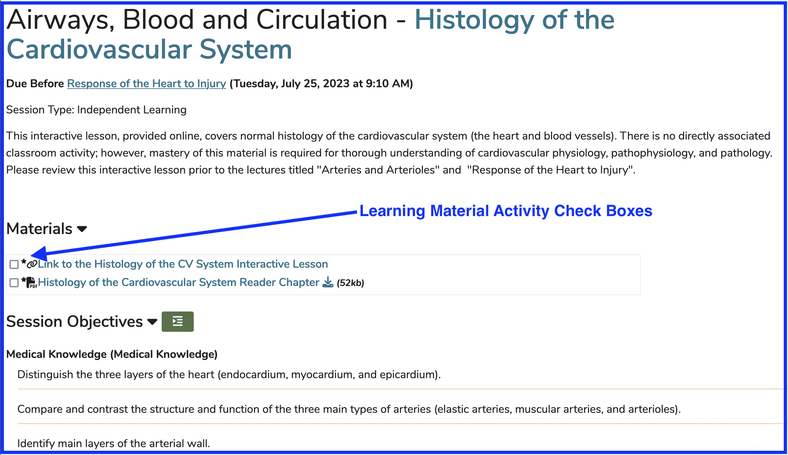
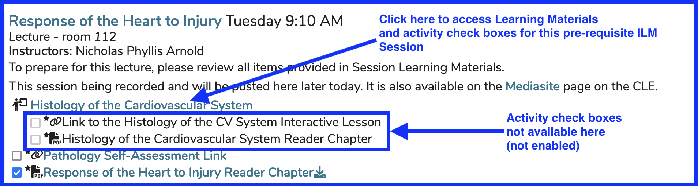

# Event Detail

The Event Detail view is reached when a user clicks on a link in their Calendar, Calendar feed, Week at a Glance (WaaG), or any part of Ilios that reaches user Events (published Offerings).

The screen shot below starts the process for a student to access the Event Detail view. In this case, the Session selected is a pre-requisite (formerly know as Pre-work) ILM due before "Response of the Heart to Injury". The associated Learning Material activities can be accessed and completed by clicking the provided link or by accessing the follow-up activity.

Links in the screen shot - explained below

* **Histology of the Cardiovascular System** - Pre-work (ILM) due prior to "Response of the Heart to Injury". User will be taken to the Event Detail view of the ILM when clicked.
* **Response of the Heart to Injury** - This is the post-requisite to the ILM listed above. User will be taken to Event Detail for the offering when clicked.
* **ABC Course Wrap-up** - Another scheduled activity for this Learner.

After clicking as shown above, the user is routed to the Event Detail of the ILM entitled "Histology of the Cardiovascular System". This event is pre-requisite for the Session "Response of the Heart to Injury".

**Learning Material Activity Check Boxes**

These are used by Learners (students) to track their progress as far as reading, viewing, or other activities related to Learning Materials for any given Session. Clicking one time will change (toggle) the check box to the next state. There are four states. 

**1.** Not Started - This is the default indicating that the student has not started reading, viewing, or performing the action of completing the assignment as it pertains to the Learning Material attached to an assigned Session.

**2.** In Progress - This is the result of clicking one time after the previous state. This means the student is working on completing the Learning Material assignment.

**3.** Completed - This is the third state of the check boxes. This means the student has completed the work associated with the assigned Learning Material. 

**4.** Not Available - In this case, the user will need to navigate to another location to both download / view the Learning Material and to ude the check box to track progress. It is necessary to drill into pre-work or "Due Before" linked Sessions to get to the Learning Material itself and to be able to utilize the check boxes. They will not be enabled from the top level (post-requisite / target) Session.

These activity check boxes will retain their state for the current user wherever they navigate to in Ilios that relates to Learning Materials.