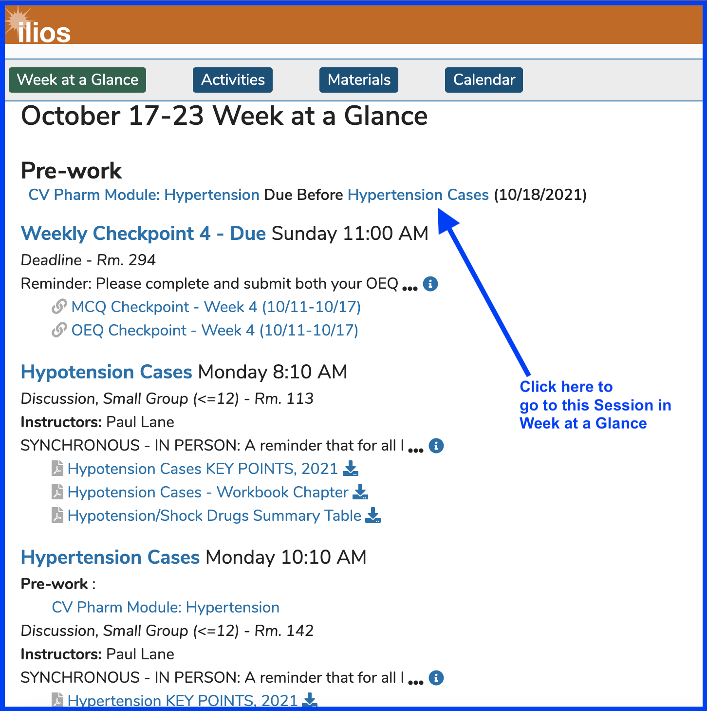
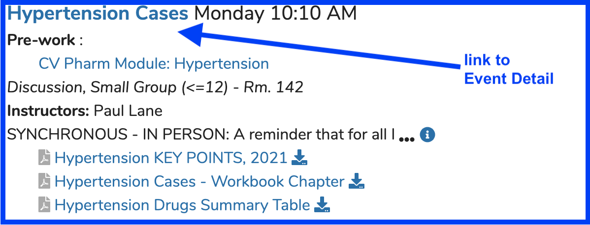
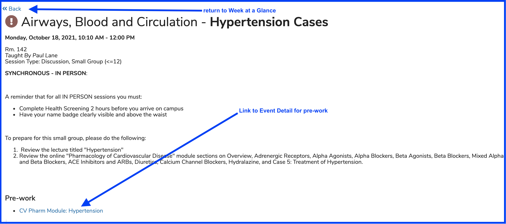
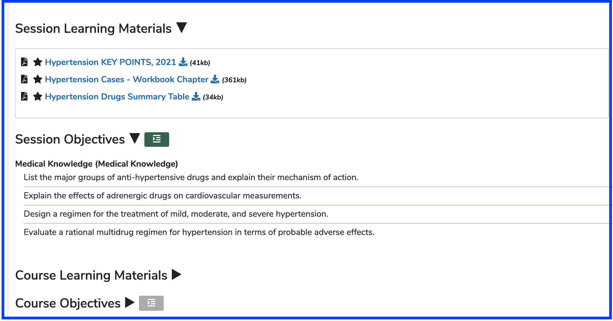
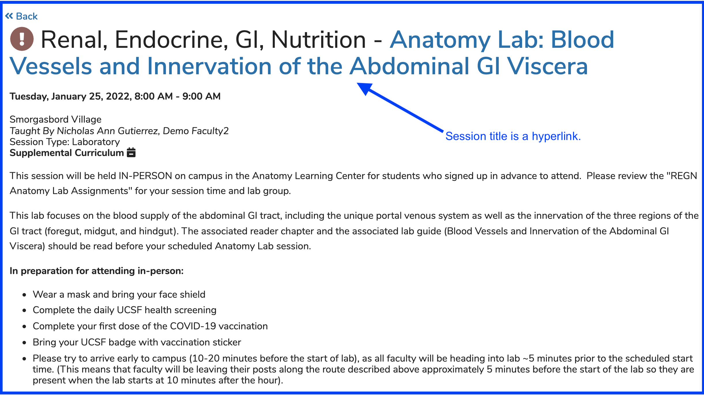
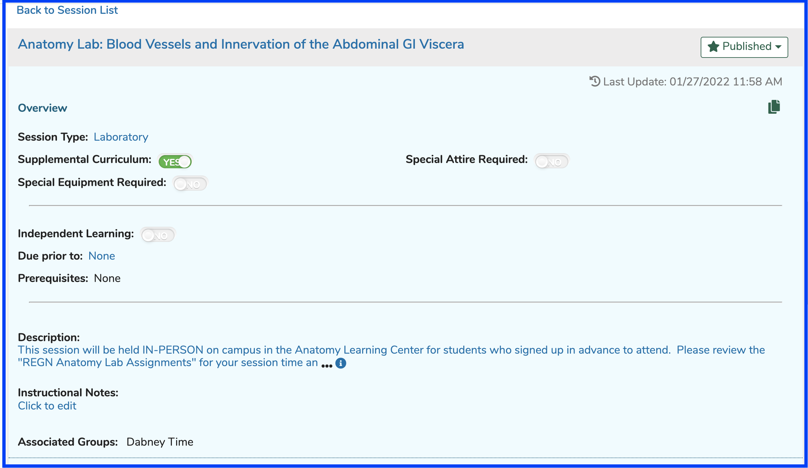

# Event Detail

The Event Detail view is reached when a user clicks on a link in their Calendar, Calendar feed, Week at a Glance (WaaG), or any part of Ilios that reaches user Events (published Offerings).

The screen shot below starts the process for a student to access the Event Detail view. In this case, the Session to be viewed in Event Detail view has an ILM attached to it.

After clicking as shown above, the user is routed to the correct location in Week at a Glance for the Session with the title of "Hypertension Cases", which is the follow-up (post-requisite) to the ILM entitled "CV Pharm Module: Hypertension".

The links shown in the screen shot above are explained below.

* **CV Pharm Module: Hypertension** - Pre-work (ILM) due prior to "Glucose Metabolism and Blood Glucose Homeostasis"
* **Weekly Checkpoint 4 - Due** - Link to that Session's Event Detail page
  * The informational "i" will expand to display the rest of the Session Description
  * Two Learning Materials (quizzes actually) are listed below as well
* **Hypotension Cases** - Link to that Session's Event Detail page
  * Two Learning Materials (both .pdf's) are available here for viewing in the browser or to download.
* **Hypertension Cases** - This is another Session this Learner is scheduled to attend at 10:10am
  * Link to the pre-work for this session (discussed above as well)
  * Learning Material available (.pdf)

After clicking as shown above, Event Detail is reached. The user can review the Location and timing of the Offering they are scheduled to be attending. Links are shown by the arrows.

The lower part of Event Detail is shown below. There may be more than one screen shot forthcoming. Included are links to all of the Course and Session Learning Materials, as well the listings of both Session and Course Objectives.

### Event Detail with Session Link

If a logged in user has access rights to Courses and Sessions, there will be a link available right on Event Detail to route these users directly to Courses and Sessions. These users who perform non-learner functions in Ilios can download the Learning Materials after accessing this link and review (or modify if applicable) the details of the Session pertaining to the Offering displayed in Event Detail.

**NOTE**: Students will not have these links available if they do non perform non-learner activities in Ilios.

After following the link shown above, the user (Instructor, Director, Administrator, Student Advisor etc.) will be routed to Courses and Sessions to the underlying Session associated with the Calendar Event detailed in Event Detail.

