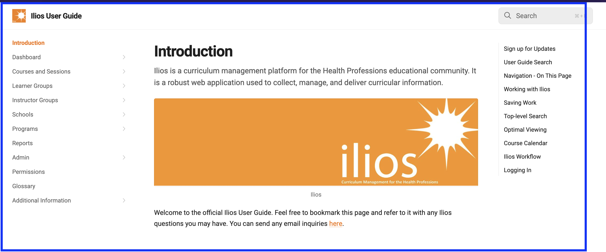

## Help Link

At the top of the Dashbaord or actually any screen in Ilios is a link to take the user directly to this guide.

### Link to User Guide

<figure>
  
  <figcaption>
      
link to user guide

  </figcaption>
</figure>

### User Guide Displayed

A new browser tab will open up routing the user to the following page - the start of this very guide. The Ilios session still is active in the previous browser tab.

<figure>
  
  <figcaption>
      
user guide displayed

  </figcaption>
</figure>