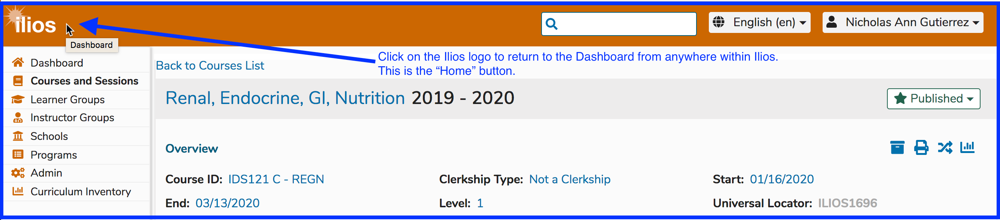
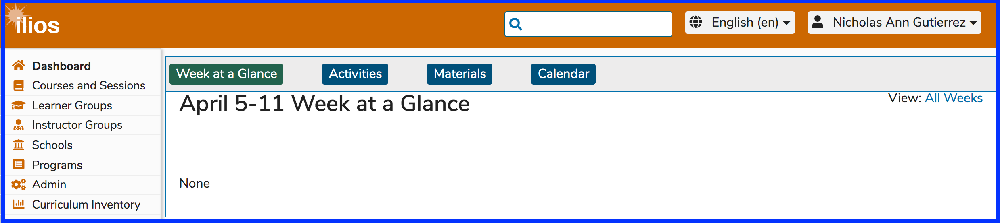

# Home

After clicking the Ilios home button as shown above, you will be returned to the Dashboard. Ilios will retain the relative location (Dashboard option) you had been accessing before navigating away. In other words, if you had selected an option other than Week at a Glance, that would have been retained and you would be back on the Dashboard with the Calendar displayed, for example (or "Activities" or "Materials").

