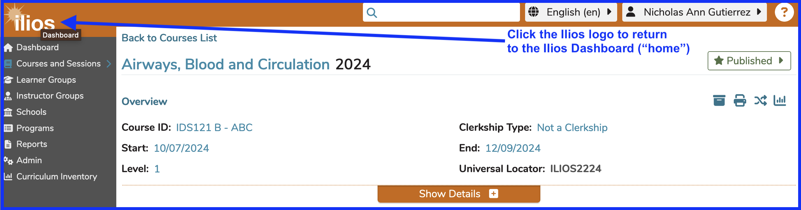
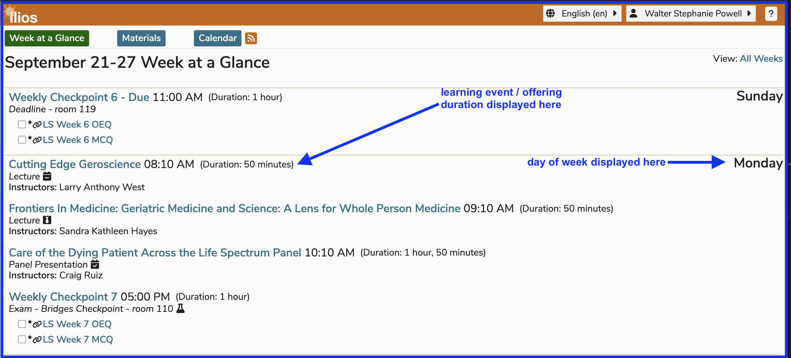

# Home

<figure>
    
    <figcaption>
        
Return Home

    </figcaption>
</figure>

The "Home" button is accessible anywhere within Ilios. In this example, we are on the Courses and Sessions page with the Course "Airways, Blood and Circulation - 2024" having been selected.

After clicking the Ilios home button as shown above, you will be returned to the Dashboard. Mousing over the Ilios logo provides the pop-up caption of "Dashboard". This is shown in the screen shot as well. Ilios will retain the relative location (Dashboard option) you had been accessing before navigating away. In other words, if you had selected an option other than Week at a Glance, that would have been retained and you would be back on the Dashboard with the Calendar displayed, for example (or "Materials").

## Week at a Glance - Admin View

The view shown below is that of an Ilios user who also perform non-learner functions. That is why the Ilios flyout menu is available with all navigational options available to this user.

<figure>
    
    <figcaption>
        
Week at a Glance - Dashboard

    </figcaption>
</figure>

## Week at a Glance - Student View

This next view will show a typical student's viewpoint into the system with no additional icons available from the Ilios flyout menu. Week at a Glance is their main focus with all weekly learning activities and materials available here. The day of the week of their weekly learning activities is shown over to the right. This will pin at the top of the screen as the screen is scrolled down as a navigational aid.

<figure>
    
    <figcaption>
        
Week at a Glance - Dashboard - learner view

    </figcaption>
</figure>

## Mouse-Over

Although this is pointed out in the screen shot at the top of this page, it is worth noting that this action (mouse-over) can be performed anywhere in Ilios if you are wondering what an icon or link means and where you will end up if you click that link. 

**NAVIGATION TIP**
The mouse-over presents the destination (target link) of any clickable link. This can be a very helpful navigational aid.

<figure>
    
    <figcaption>
        
Mouse-over link target shown

    </figcaption>
</figure>
