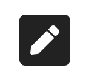

# Icons Explained

This section of the guide is designed for Learners \(students\) to help explain icons you will see within the Ilios application as you use it. This list may not be complete yet as of July 20, 2020. You can expect more updates coming soon.

**NOTE:** The actual URL is available to the left of the icon shown above. It is titled "Virtual Session Link". This link is also available further down in the Event Detail as well with the full URL written out.

