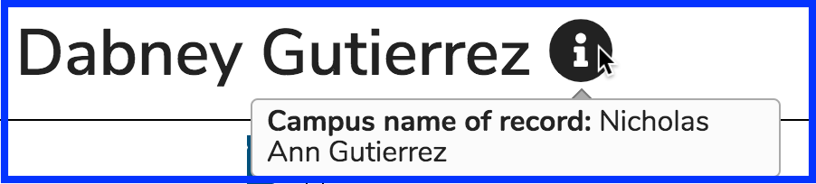

# Icons Explained

### Student Facing Icons

**NOTE:** The actual URL is available to the left of the icon shown above. It is titled "Virtual Session Link". This link is also available further down in the Event Detail as well with the full URL written out.

**NOTE:** There is also an "Attendance Required" icon that is used by the School of Pharmacy at UCSF. It is possible to create custom icons and activate them on a school level. The screen shot of this icon is shown below.

### Non-learner Facing Icons

**NOTE**: Mousing over the informational icon as it pertains to user name will provide the campus name of record. An example is shown below (from the Admin Console) after pulling up the user record. The user's name was originally "Nicholas Ann Gutierrez" rather than what it currently is in Ilios "Dabney Gutierrez".

The icon below is displayed on the Calendar when an offering has not yet been published. Only Ilios users with non-student user roles will see these on the Calendar. Students only see published offerings.

