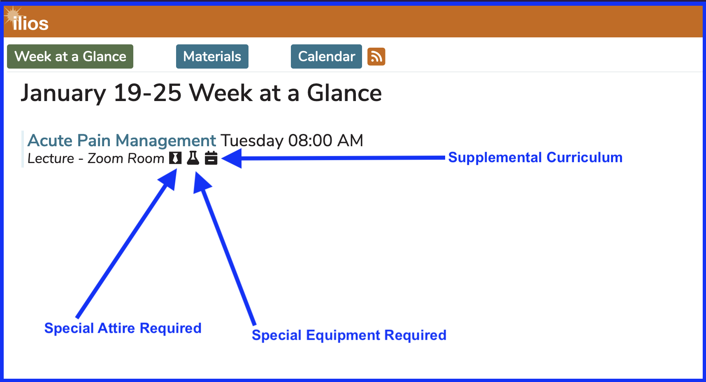
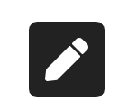
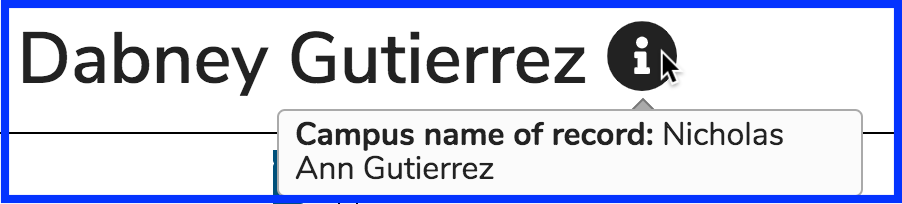
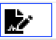

# Icons Explained

## Student Facing Icons

### Materials Link

This is a zoomed-in close up of the image that appears on the Event Detail screen. Clicking on this image will route the user to [Materials View](https://iliosproject.gitbook.io/ilios-user-guide/dashboard/materials-view) where all learning materials pertaining to this student can be retrieved and/or viewed. The course drop-down will have the current course selected. The current course refers to the one pertaining to the current session.

**TIP:** Select "All Courses" from the drop-down if it is desired to see all materials from all courses. 

Here it is below in a bit better context on the [Event Detail](https://iliosproject.gitbook.io/ilios-user-guide/dashboard/event-detail-view) screen.

### Special Attire Required

### Special Equipment Required

### Supplemental Curriculum

The three icons shown above (Special Attire, Special Equipment, and Supplemental Curriculum) will appear up on Week at a Glance and Event Detail when they have been set to "true". Hovering any of these icons over using a mouse will cause a description of the icon to appear hovering above the icon.

The image belows shows the appearance of all three of the above icons on Week at a Glance ...

### Virtual Meeting Link

**NOTE:** The actual URL is available to the left of the icon shown above. It is titled "Virtual Session Link". This link is also available in Event Detail as well with the full URL available on mouse-over.

### More Information available

### Learning Material Icons

The icon above will not appear if the learning material's usage is optional - not required.

### Recently updated

### Instructional Notes 

### Attendance Required

**NOTE:** There is also an "Attendance Required" icon that is used by the School of Pharmacy at UCSF. It is possible to create custom icons and activate them on a school level. The screen shot of this icon is shown below.

### User Guide Link

The link to the Ilios Help Guide is available to all Ilios users. It is always available at the far upper right of the main screen.

### Link to .ics feed

This button is conveniently located just to the right of the "Calendar" button. This is for copying the .ics feed for use in online calendars including Outlook and Google - click for [here](https://iliosproject.gitbook.io/ilios-user-guide/dashboard/calendar-view/calendar-feed-options) for more information.

## Non-learner Facing Icons

### Name Record Icons

The above icon appears if the campus name of record is different from the Ilios user name. See below for more information.

**NOTE**: Mousing over the informational icon as it pertains to user name will provide the campus name of record. An example is shown below (from the Admin Console) after pulling up the user record. The user's name was originally "Nicholas Ann Gutierrez" rather than what it currently is in Ilios "Dabney Gutierrez".

### Pre-work attached
Sessions can't be deleted when this is the case since more than one other session depends on the existence of this one. 

### Unpublished Offering
The icon below is displayed on the Calendar when an offering has not yet been published. Only Ilios users with non-student user roles will see these on the Calendar. Students only see published offerings. These have been thought of in the past as having been in "Draft" status.

