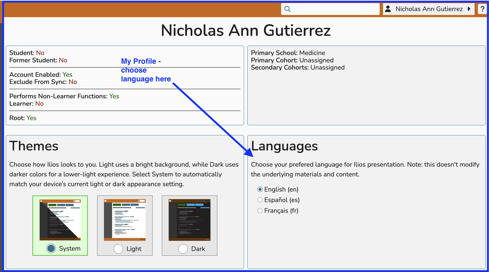
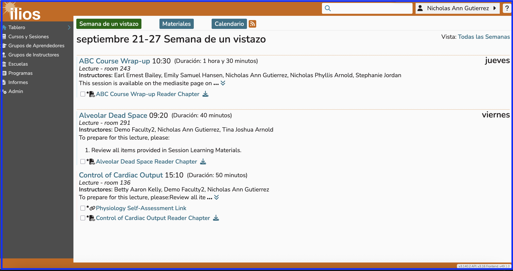

# Language Selector

It is possible to change the language of the majority of the captions in Ilios to be in (at this point) Spanish or French. These translations are as accurate as possible but may be revised pending feedback from users.

The language selector is located along with other user preferences in [My Profile](https://iliosproject.gitbook.io/ilios-user-guide/dashboard/my-profile), under the heading "Languages". The section of My Profile where this is located is shown below. 

<figure>
  
  <figcaption>
    
language selector

  </figcaption>
</figure>

For the sake of illustration and demonstration, here is what happens when the option (Español (es)) has been selected in My Profile to change the application's text values to Spanish. The menu items, labels, and captions get updated. The underlying data is not translated in any way but could be entered in Spanish or French or any other character-compatible spoken/written language.

<figure>
  
  <figcaption>
    
Week at a Glance - Spanish

  </figcaption>
</figure>
