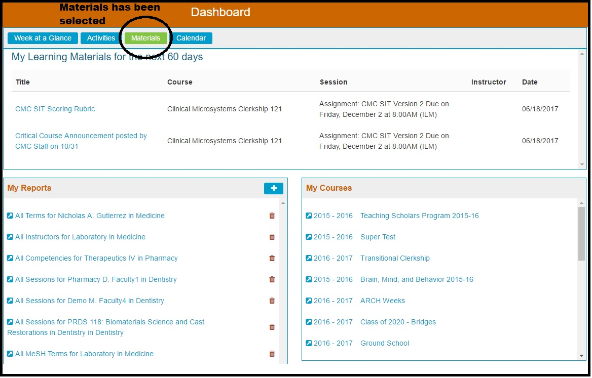

# Materials View

With the Materials view, all Learning Materials which have Offerings within the next 60 days are displayed in a similar format to how the Activities were presented in the "Activities" view. [**My Reports**](https://iliosproject.gitbook.io/ilios-user-guide/dashboard/my-reports) and [**My Courses**](https://iliosproject.gitbook.io/ilios-user-guide/dashboard/my-courses) are accessible from here as well.

**NOTE**: Since this pertains exclusively to "Learning Materials", these materials apply only to Students. Instructors and Course Directors will not see any Learning Materials here.

Clicking on the title of the Learning Material will route the user to be able to access and / or download the Learning Material file, link, or citation. If it is a link, the web site will open. Citations are displayed in completeness right there and there is nothing to click or follow. Files will be downloaded to the user's computer.

