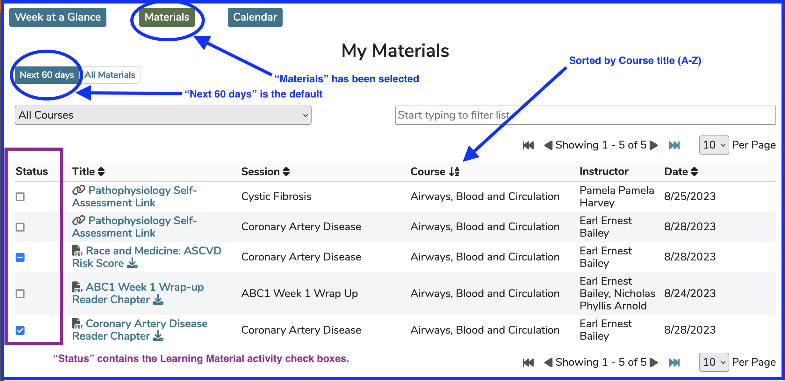

## Materials View

With the Materials view, all Learning Materials which have Offerings within the next 60 days are displayed initially. This can be changed to display "[All Materials](https://iliosproject.gitbook.io/ilios-user-guide/dashboard/materials-view#all-materials)" - everything associated with this student's educational trajectory. It is important to note that if there is no value displayed in the "Session" column, these are Course level materials and do not pertain to any specific session.

**NOTE**: Since this pertains exclusively to "Learning Materials", these materials apply only to Students. Instructors and Course Directors will not see any Learning Materials here.

## Next 60 Days

Clicking as shown above on "Materials" brings up the Learning Materials the student will be using for the offerings occurring at any point in the next 60 days. "All Materials" can be toggled here which will have the same window but with all Learning Materials the student has ever encountered. Pagination helps load these Learning Materials up quite quickly.

Clicking on the title of the Learning Material will route the user to be able to access and / or download the Learning Material file, link, or citation. If it is a link, the web site will open. Citations are displayed in completeness right there and there is nothing to click or follow. Files will be downloaded to the user's computer.

## Activity Check Boxes
Learning Material activity check boxes are included here as well. All three states are shown in the screen shot above (not started, in progress, or completed).

Refer to [Event Detail](https://iliosproject.gitbook.io/ilios-user-guide/dashboard/event-detail-view#learning-material-activity-check-boxes) for detailed information regarding the usage of these check boxes. This information gets displayed anywhere Learning Materials are accessed by students in Ilios. Only the logged-in student will see the check boxes. They are for personalized tracking of learning activity.

**NOTE:** These check boxes only appear for Session-level learning materials. Course-level materials serve more as high-level perennial documentation not related to specific session learning activities (i.e. no check box needed).

## All Materials

Below is a screen shot similar to the one above but this time displaying the student's entire suite of Learning Materials for their entire education experience.

"All Materials" has been selected instead of the default "Next 60 days".

## Sort Options

* LM Title
* Course Title
* Session Title
* Date (Upload Date)

## Filter Options

* LM Title
* Course Title
* Session Title
* Instructor

In the example shown below, the Data has been sorted by Title (A-Z). The default Sort Order is by Offering Date (Descending). Using the Title (A-Z) sorts all learning materials by learning material title.

**NOTE:** The date associated with Course level learning materials reflects the starting date of the course since there is no session or offering involved. Also, the session and instructor fields are both empty for the same reason. There is no "Status" box for course level learning materials since these are referral guides for the entire course.

Entering Search Criteria into the Filter search box will perform a search on ALL 4 of the fields listed above to help ensure the correct LM is found.

