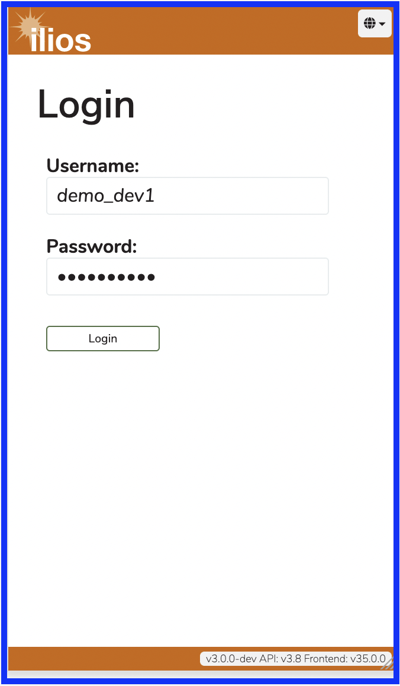
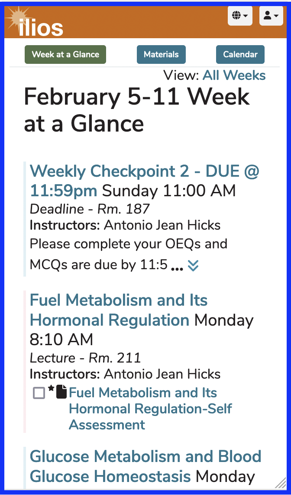
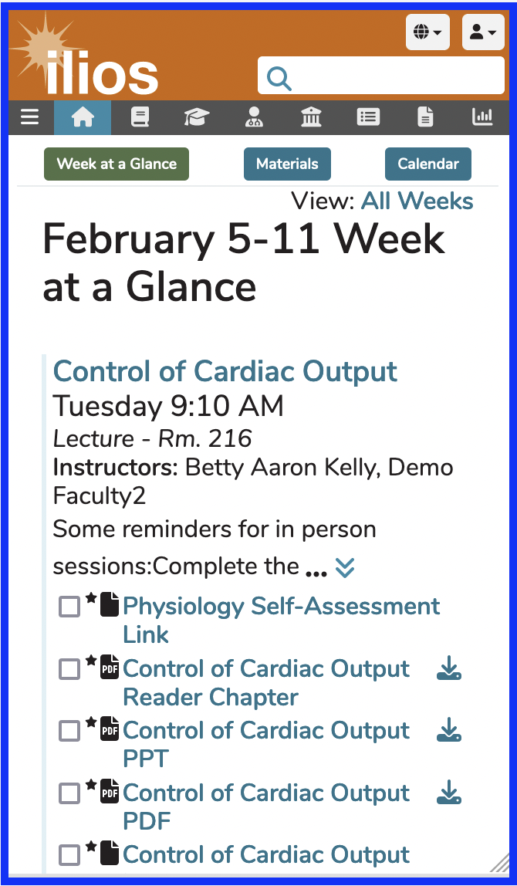
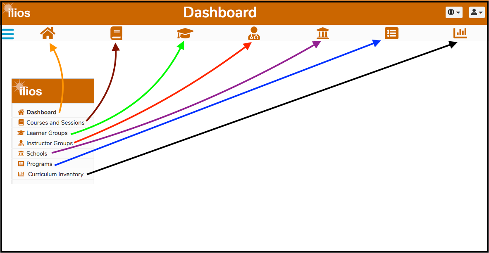

# Mobile Devices

This section contains sample screen shots of a typical user experience accessing Ilios on a mobile device, such as a smart phone. Ilios can now be used on smart phones. We have reduced the menu items to icons. 

#### Login screen (for non-LDAP emulating a mobile phone) ...

#### Dashboard (after Student logging in) ...

#### Dashboard (after Instructor logging in) ...

The only difference between the two screen shots above is that Ilios users who perform non-learner functions in Ilios get the navigational icons shown toward the top of the screen underneath the "Dashboard" label.

#### Icons Explained 

