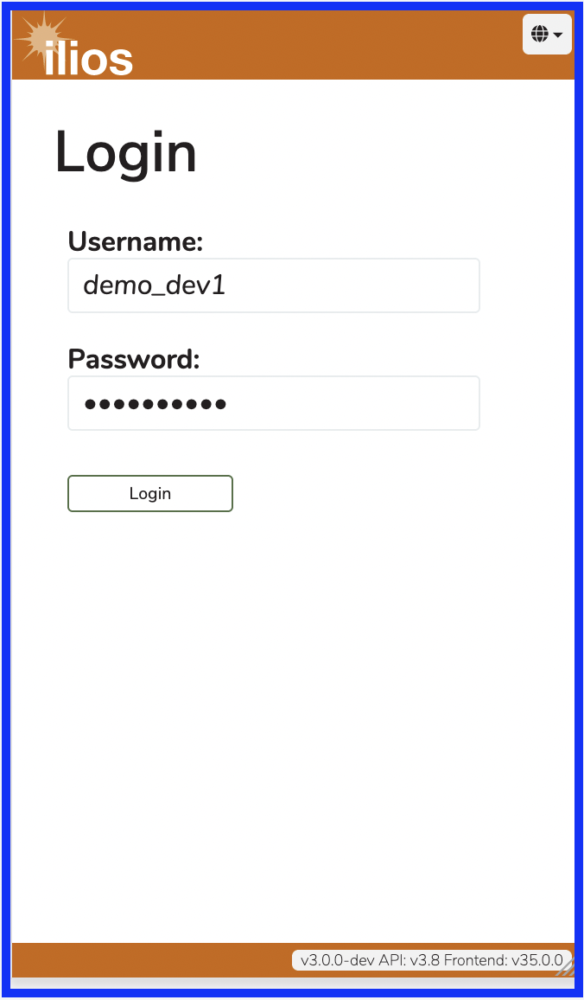
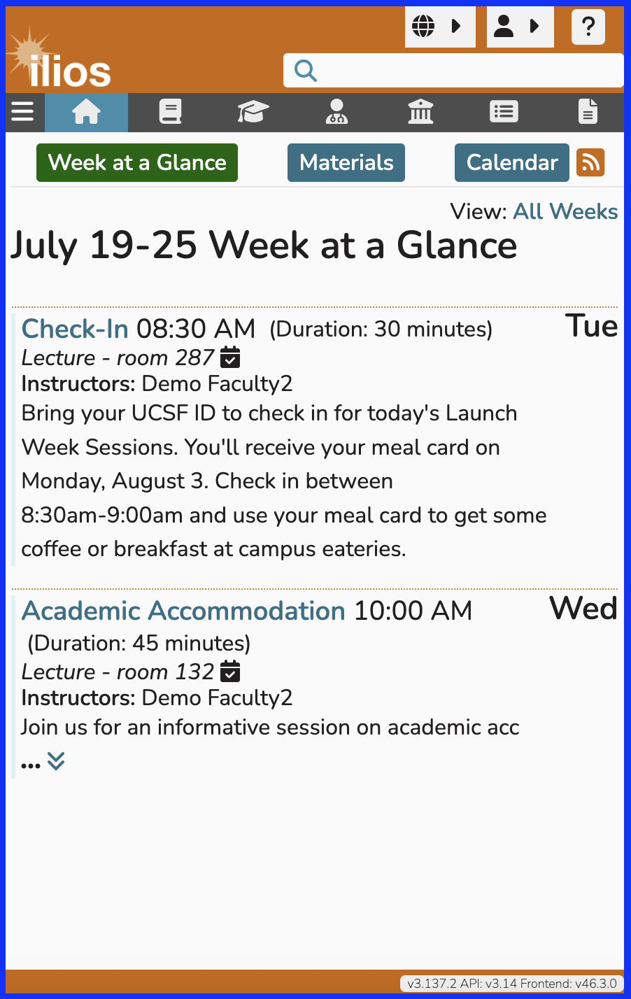
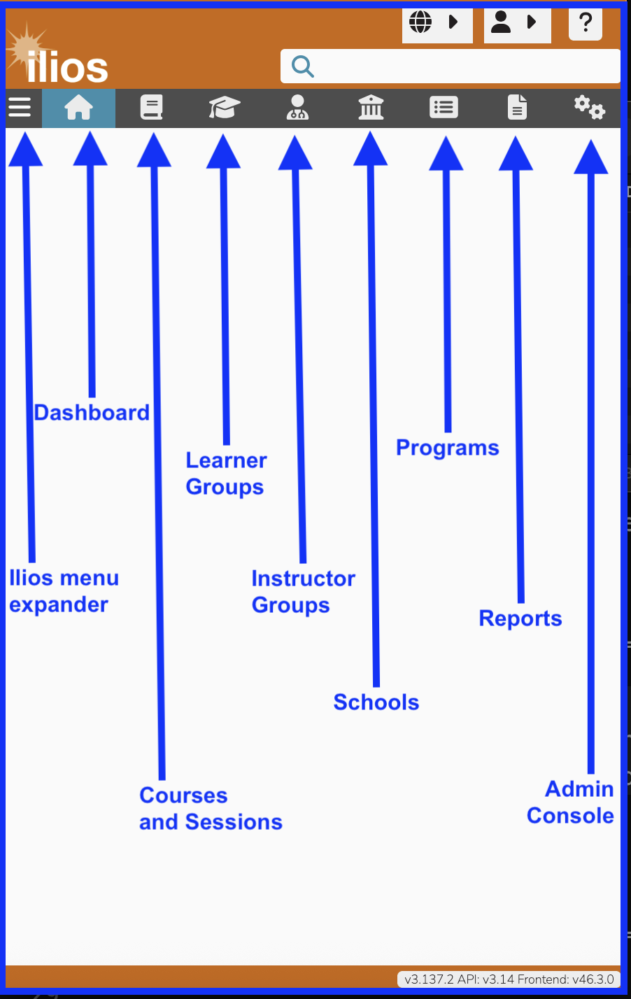

# Mobile Devices

This section contains sample screen shots of a typical user experience accessing Ilios on a mobile device, such as a smart phone. Ilios can now be used on smart phones. We have reduced the menu items to icons. 

## Login screen 

The screen shot below is form-based non-LDAP login emulating a mobile phone.

## Dashboard - student

After a student logs in, with Week at a Glance selected, the learner will see a view similar to the one shown below.

## Dashboard - instructor

After an Instructor logs in, with Week at a Glance selected, the screen will appear similar to the one shown below. 

The only difference between the two screen shots above is that Ilios users who perform non-learner functions get the navigational icons shown toward the top of the screen underneath the "Dashboard" label.

## Icons Explained 

The icons appearing at the top of the mobile view screen are described in the image below. The Ilios menu expander, pointed out in the image above, is available to view the captions along with the icons. This image is with the expander in "contracted" mode.

