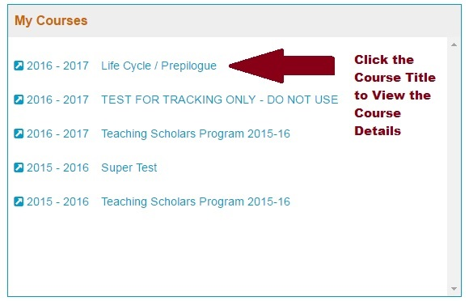
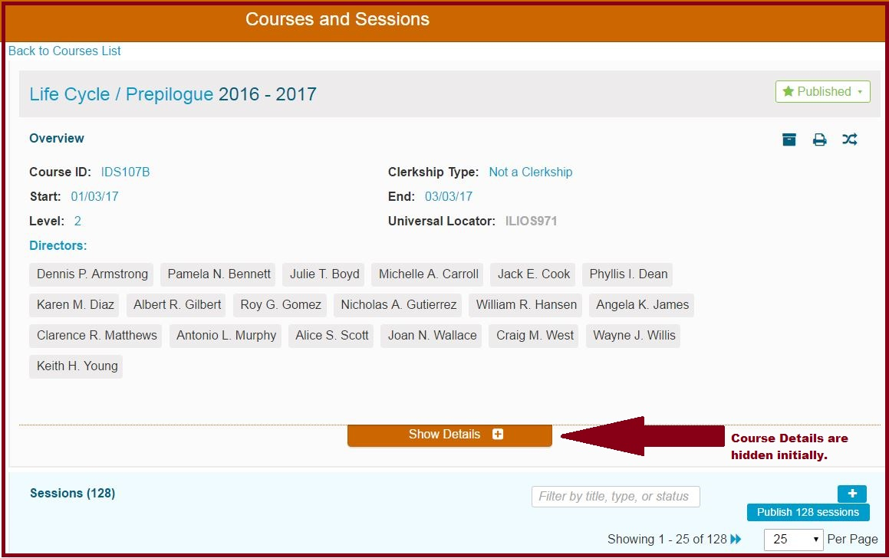

# My Courses

### **My Courses**

* Displays all upcoming or current Courses associated with the logged-in user - student or non-student. If you are logged in as a user who perform non-learner functions, clicking on the Course Title link will take you to that course's Course Detail page. Students do not get activated links; just informational text displaying their courses.

This is demonstrated below.

Clicking on the Course Title \(Life Cycle / Prepilogue\) takes the user to the Course Detail screen for the selected Course as shown below.

**NOTE:** To return to the Dashboard, the back button on the browser can be used or instead use the Back to Courses List to go the Courses page.

