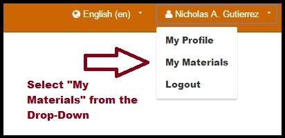
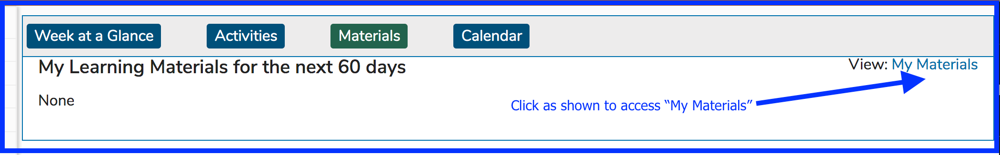
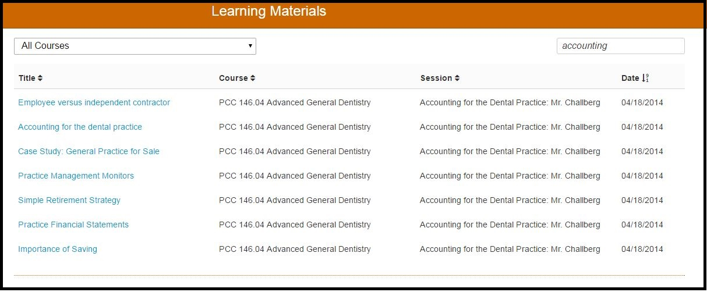

# My Materials

"My Materials" refers to Learning Materials. All Learning Materials associated with the logged in user can be retrieved and reviewed here. Follow the action below to pull up "My Materials". This is different from accessing the "Materials" view on the Dashboard in the sense that there is no time limitation with this path. It pulls up everything throughout the user's entire Ilios Student history. In this way, it is different from the Dashboard Learning Materials view which is more like an agenda of upcoming Learning Materials with which the Student will need to interact.

There are two ways to access this screen.

**One**: From the drop-down menu as shown below.

**Two**: The "My Materials" link and screen is also available from "Materials" on the Dashboard as shown below.

## Sort Options

* LM Title
* Course Title 
* Session Title
* Date \(Upload Date\)

## Filter Options

* LM Title
* Course Title
* Session Title
* Instructor

In the example shown below, the Data has been sorted by Session \(A-Z\). The default Sort Order is by Offering Date \(Descending\). Using the Session \(A-Z\) as a sort order puts the Course level Learning Materials at the top of the list as shown below. 

Entering Search Criteria into the Filter search box will perform a search on ALL 4 of the fields listed above to help ensure the correct LM is found.

In the example shown below, the filter has been applied for "Accounting". The records returned all had Sessions Titles that contain the word "Accounting". If "Accounting" were contained in either of the other two fields, those values would have been returned as well. Any Learning Material file or link can be accessed now by simply clicking on the URL link contained in the LM Title field \(highlighted in blue\).

