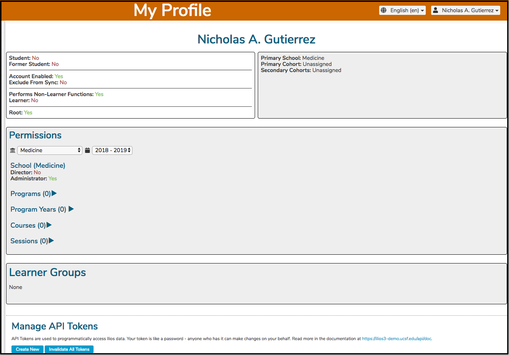
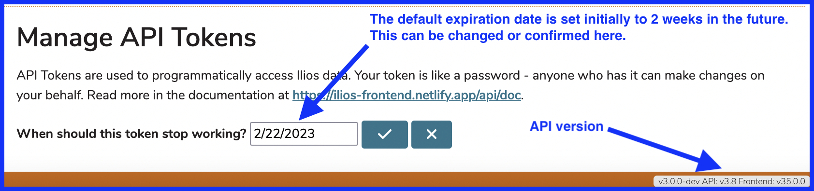
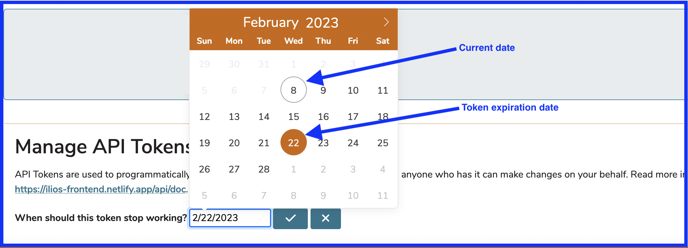
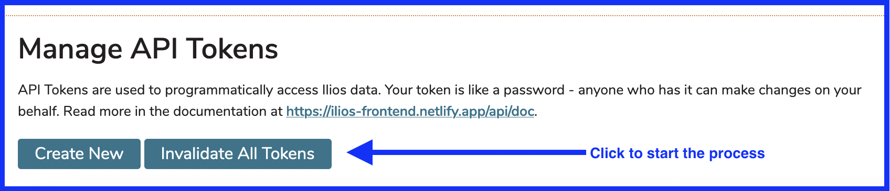
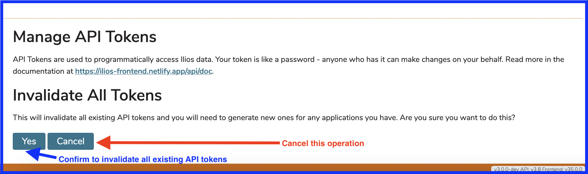

# My Profile

The My Profile screen is a useful way to troubleshoot issues in Ilios. Any Ilios user can access this information by clicking as shown below. This is on the Dashboard - upper right portion of the screen.

In this case, "Nicholas Ann Gutierrez" is the logged-in user, and also the user whose Profile will be displayed. This is also a good example of a student's view into the Ilios system with a populated populated Week at a Glance (WaaG) view.

## My Profile (details)

After clicking My Profile, as shown above, the details regarding your logged-in account are displayed as shown below.

This screen is informational only - except for the API Token Management, which is covered below. We can see that Nicholas A. Gutierrez (me) has a high level of permissions (Developer - the most powerful role), (Instructor - can be selected as Instructor for Course Offerings), and (Course Director - can be selected as Course Director in Ilios). Nicholas is not a Student and is not assigned to any Cohort or Learner Group.

**Other Fields**

* **Former Student** - This is selected when the logged in user is (was) a Student who has graduated.  This information can be obtained via a nightly synchronization job with your directory server.
* **Exclude From Sync** - This is selected when this user is to be considered an exception regarding the synchronization job. Ilios retains its data and overwrite attempts are not performed based on data coming from the directory server.

## Manage API Tokens

As explained in the application ...

`API Tokens are user to programmatically access Ilios data. Your token is like a password - anyone who has it can make changes on your behalf. Read more in the documentation at ...`

[https://ilios3-demo.ucsf.edu/api/doc](https://ilios3-demo.ucsf.edu/api/doc).

### Create New Token

To create a new API Token, click Create New. The screen will refresh and display as shown below.

#### Date Picker

The Date Picker (if selected) appears as shown below.

### Invalidate All Tokens

Invalidate All Tokens - this will ensure that all of your tokens are no longer able to be used. Access will be denied entirely. You can do this if you are no longer going to be accessing the API using tokens and / or you feel a token has been compromised.

After choosing the `Confirm` option, a confirmation message flashes in the upper part of the screen.

