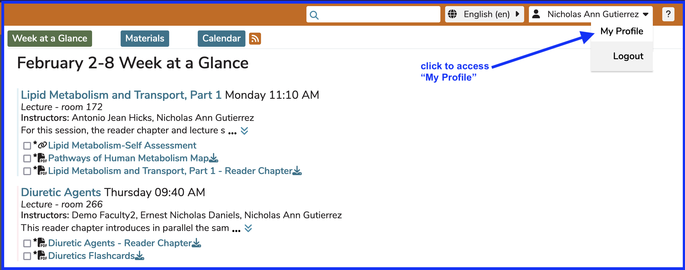

# My Profile

## Open My Profile

The My Profile screen is a useful way to troubleshoot issues in Ilios. Any Ilios user can access this information by clicking as shown below. This is on the Dashboard - upper right portion of the screen.

In this case, "Nicholas Ann Gutierrez" is the logged-in user, and also the user whose profile will be displayed. 

## My Profile Details

After clicking My Profile, as shown above, the details regarding your logged-in account are displayed as shown below.

This screen is informational only - except for the API Token Management, which is covered below. Nicholas has been assigned the "Adminstrator" role in School of Medicine. We can also see that Nicholas A. Nicholas is not a Student and is not assigned to any Cohort or Learner Group. Any Ilios user can be assigned any permission within any of their assigned schools. They can only have one primary school but this does not prevent assignment of any role in their secondary schools.

### Display Fields

* **Student** - simply indicates whether this user has been attached to any learning activity in Ilios ever
* **Former Student** - indicates when the logged in user is (was) a Student who has graduated.  This information can be obtained via a nightly synchronization job with your directory server.
* **Account Enabled** - read-only display of the status of the logged-in user's account (will always be "Yes" in this context) - modified in the Admin Console 
* **Exclude From Sync** - selected when this user is to be considered an exception regarding the synchronization job. If this is the case, Ilios retains its data and overwrite attempts are not performed based on data coming from the directory server.
* **Performs Non-Learner Functions** - indicates if this user has been attached to any learning activity ever as a "non-learner", typically as an Instructor, Administrator, Director, or Student Advisor
* **Learner** - indicates anyone who has ever been assigned to “learn” in an activity or session - not necessarily an enrolled cohort member derived from the campus system of record or SIS (Student Information System)
* **Root** - indicates if this user has `root` level permissions (the highest) for the Ilios system at this School's implementation.

To the right of these fields are three fields identifying this user's "Primary School", "Primary Cohort", and "Secondary Cohorts".

### Permissions

These are listed with a school-based drop-down (if applicable). These are all maintained in other places in Ilios. Available information includes ...

* School-level permissions - Director and / or Administrator assignments are shown 
* Program - indicates if user is a Program Director
* Program Years - indicates if user is a Program Year Director
* Courses - displays (with links) courses for which this user been assigned Director, Administrator, Instructor, or Student Advisor roles
* Sessions - displays (with links) sessions for which this user has been assigned Administrator, Instructor, or Student Advisor roles
* Learner Groups - displays a list of all Learner Groups into which this user has been added.

## Manage API Tokens

As explained in the application ...

`API Tokens are user to programmatically access Ilios data. Your token is like a password - anyone who has it can make changes on your behalf. Read more in the documentation at ...`

[https://ilios3-demo.ucsf.edu/api/doc](https://ilios3-demo.ucsf.edu/api/doc).

### Create New Token

To create a new API Token, click Create New. The screen will refresh and display as shown below.

### Select Expiration Date

The date picker (if selected) appears as shown below. Use this to select an exipration date for the token being created.

### Invalidate All Tokens

Invalidate All Tokens - this will ensure that all of your tokens are no longer able to be used. Access will be denied entirely. You can do this if you are no longer going to be accessing the API using tokens and / or you feel a token has been compromised.

After choosing the `Confirm` option, a confirmation message flashes in the upper part of the screen.

