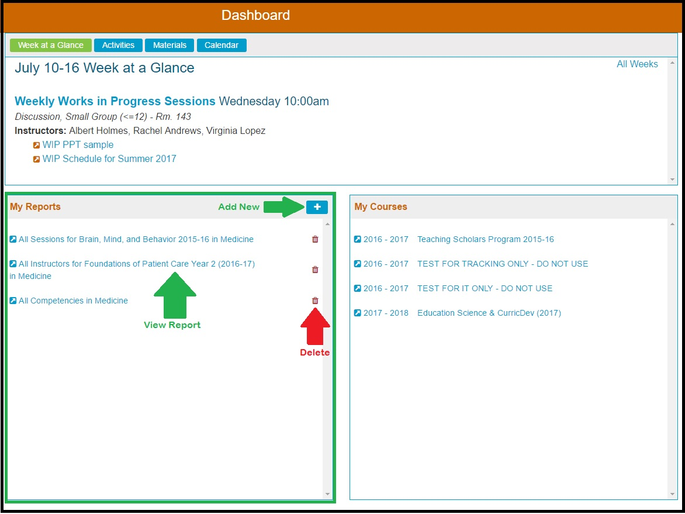
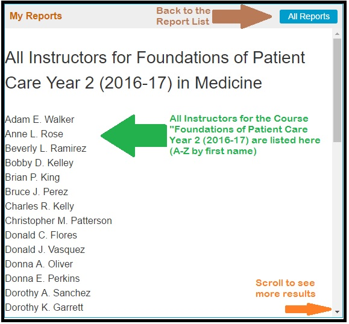
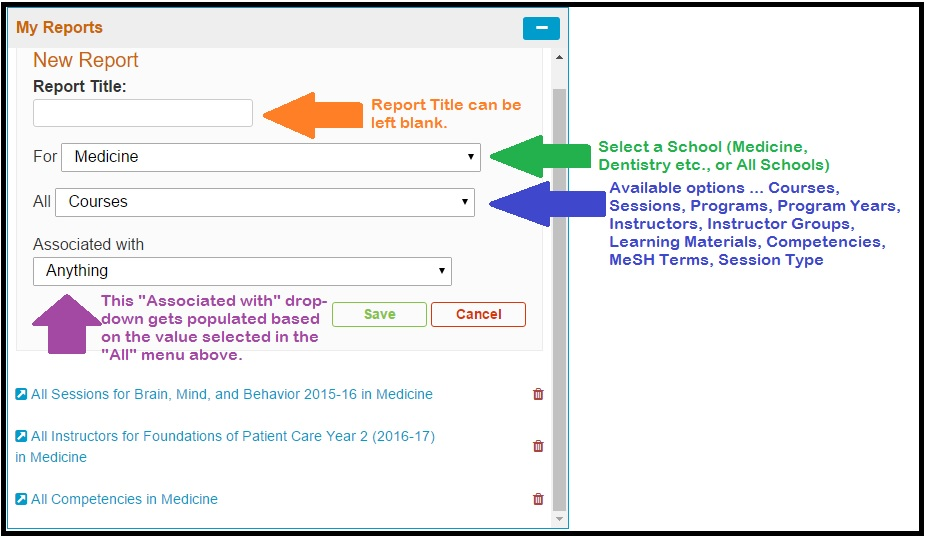
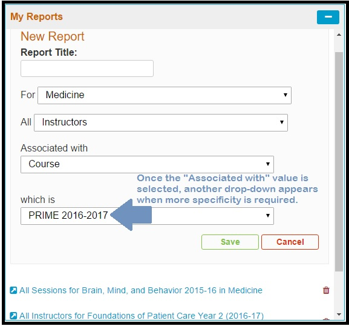
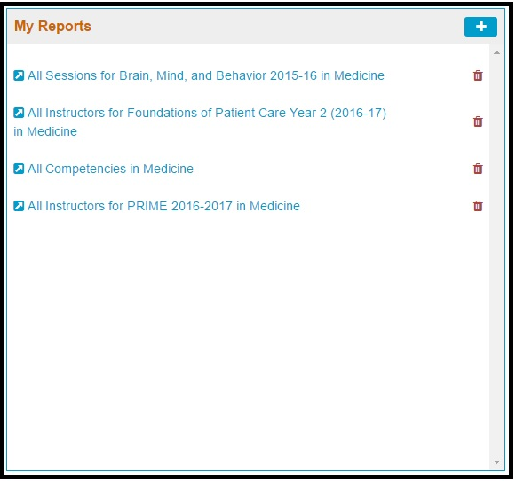

# My Reports

### My Reports

My Reports contains all of the Reports created by the logged-in user. They can be accessed by clicking on the Report Title. New Reports can be created by clicking the \(+\) button.

The My Reports section on the Dashboard allows users to create and save quickly accessible snapshot style Reports. There are many combinations of data elements that can be used to generate custom data sets. These are also made available for download - to a .csv file.

My Reports is available on the Dashboard in the lower left portion of the screen as shown below. It is available whether or not the Calendar is being displayed.

The custom reports in My Reports have auto-generated names but you can override this and provide your own name if you prefer.

Review the "All Instructors for Foundations of Patient Care Year 2 \(2016-17\)" by clicking on the link to display the following data.

## Create A Custom Report

To create a custom report, click the \(+\) icon to start the process. Refer to the Dashboard screen shot at the top of the page.

The following interface appears once the \(+\) icon has been clicked.

One final field appears when more information is needed.

Once "Save" is clicked, a new report will be generated with the title "All Instructors for PRIME 2016-17 in Medicine" as shown below.

