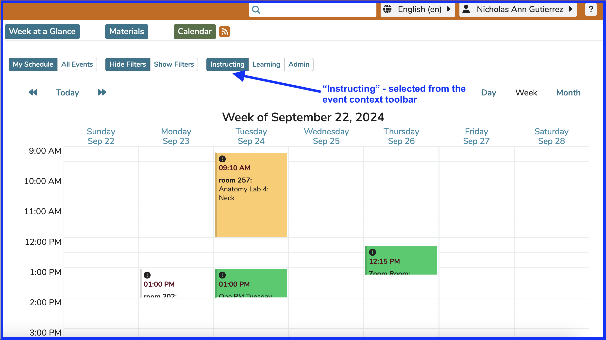
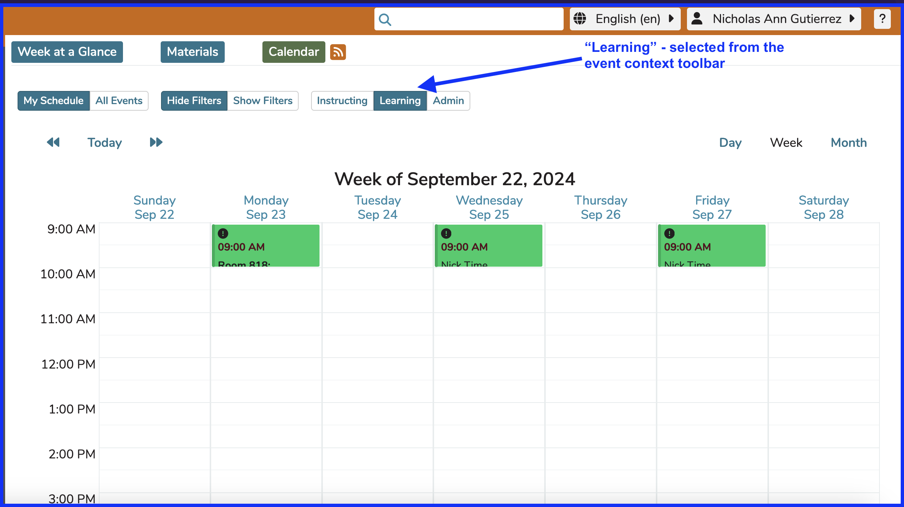
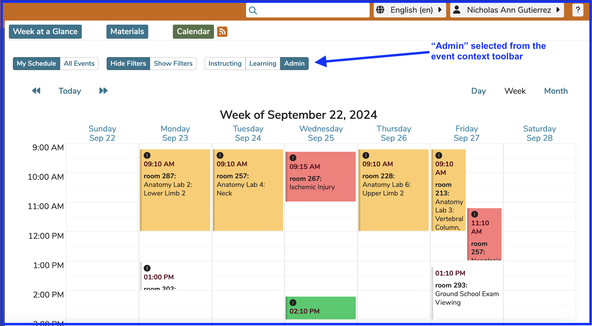

# Student-Only View 

The screen shot below shows what a typical student would see after clicking "Calendar" from the Dashboard. "My Schedule" is the default when any Ilios user accesses the Calendar. This student has not been assigned any teaching or administrative roles in Ilios yet. If their record were to be retrieved from the Admin Console by a user with more advanced privileges, the "Performs Non-Learner Functions" would be set to "No" by the system. They do not see the Ilios flyout menu or the Event View Settings toolbar until they have been assigned non-learner activities in Ilios. 

# Event Context Buttons

This toolbar appears for Ilios users who are involved with activities other than learning. This includes being attached as an instructor to offerings or ILM's, as an administrator or director of a course, or administrator of one or more sessions. The toolbar containing these event context buttons is shown below with the "Admin" button selected. 

There are a total of four different combinations of selections on these so-called "event context buttons". The selection here determines which events appear on the calendar. In a nutshell, the options are as follows ...
 
## Instructing

Choosing this option means that only the events for which the logged-in user is attached as an instructor will appear on the calendar indicating their instructional schedule.

This is shown below. Only the events associated with the logged-in user as the instructor are shown. Any other events are hidden in this context. 

## Learning

This option will display all of the events in this user's learning schedule. This means all of the offerings or ILM's for which they are included in an associated learner group appear on their calendar along with any offerings or ILM's to which they have been added as an Individual learner (not as a member of any group).

## Admin

Choosing "Admin" results in all "overseen" offerings or ILM's to be displayed. This is mainly for course directors or administrators but it also applies to session administrators if assigned at that level. The "Admin" view is shown below.

## All Three Selected

It is possible (and easy) to have all three of the above buttons selected at the same time. All three of the activities for the logged-in user appear when this is the case (Instructing, Learning, and Admin). If any one button is selected, click on the same button again. The result of this action will be that all three buttons are now selected. Click any one button again and that will have that one now be selection.
