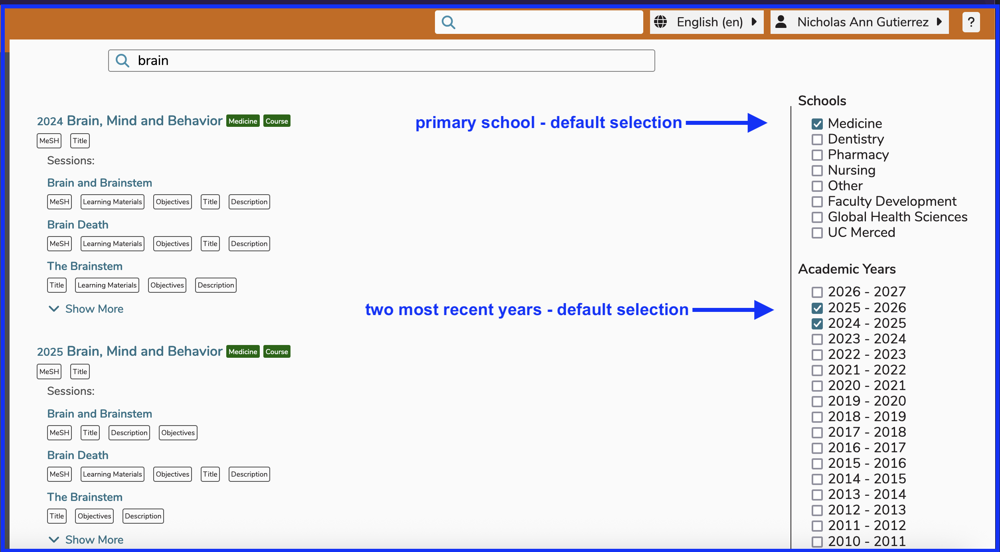

# Global Search

**NOTE**: Global Search is not currently available to users who are students and do not have any higher-level permissions or perform instructional or other non-learner functions in Ilios. This may change in the future.

The search box is located at the location specified above. Enter a search string and press Enter on the keyboard to run the search. Refer to [Search Results](https://iliosproject.gitbook.io/ilios-user-guide/dashboard/search#search-results) for more information on understanding the results of a search performed.

The search provides content search to users with heightened privileges (non-students) across the curricula at your institution. Access beyond read-only for search returns is determined by individual permissions for each user account.

An entered search term will query across a broad array of areas within Ilios. These currently include:

* Course Title
* Course Objectives
* Course Learning Material Title
* Course Learning Material Description and Metadata
* Course Learning Material Content
* Course Vocabulary Terms
* Course MeSH Terms
* Session Title
* Session Description
* Session Objectives
* Session Learning Material Title
* Session Learning Material Description and Metadata
* Session Learning Material Content
* Session Vocabulary Terms
* Session MeSH Terms

Results are labeled according to the location of the match and listed with internal weighting to provide the most relevant results first.

After performing a search, all of the areas listed above are scanned for matches. Suggestions are also provided.

## Learning Material Contents

The newest addition to Ilios global search is that it now scans the complete text content of all Learning Materials in the system, along with curriculum data and metadata.

When you enter a search, the search results will be based not only on titles, terms, descriptions, and objectives in the curriculum; they will also take into account the complete text of associated learning materials, in order to provide a more robust and accurate results set.

Since content can often provide significantly more effective definition of learning focus, results which take this into account allow for a much more realistic analysis of the curriculum. Additionally, if descriptions of learning, or objectives for learning have begun to diverge from actual didactic activity, including LM content allows the easier identification and remediation of this effect.

## Performing a Search

To search for anything related to "brain", enter that string value into the search field provided. 

To perform a search, press the "Enter" (or "return") key on the keyboard after entering the search string to retrieve the corresponding results.

### Re-run Search

Making any changes using the check boxes specifying "Schools" and / or "Academic Year" will cause the search to be run an additional time immediately with the newly specified parameters.

The "Enter" or "return" key on the keyboard can be used to run again also but does require the keyboard command to execute. This is true whether or not the search value has been updated.

## Search Results

The results of running a search for "brain" are demonstrated below.

## Cancel Search

To cancel any search after entering criteria but before pressing "Enter", the keyboard's "escape" key (`esc`) can be utilized to clear out the search box value.

## Show More

Search results are grouped by Course, and then by Session. In the case above, the top three sessions that match (in order of match accuracy) are displayed. Clicking the "**Show More**" link, which appears below the first three results for each Course, will open up and show the rest of the sessions within that course that match. For example, after the first "**Show More**" link located under the session link for "Defining the Mind", the screen now displays the rest of the sessions in the course called "Brain, Mind, and Behavior".

## Show Less

Clicking the "**Show Less**" link will return the screen to the previously displayed top three results. This link only appears after "**Show More**" has been clicked.

**NOTE:** Global search is not available for students at this time.

## Filter Results

Once a search has been performed using the Global Search functionality, the results can be further refined (filtered). The following shows two types of filtering that can be done here.

### Output Filters

Filtering by school and / or  by year is accomplished by using any combination of selections made using the two sets of available check boxes. Any combination of these two sets of check boxes can be used. They function independently and in conjunction with each other. Both year filter and school filters are applied together. An updated screen shot with more details is forthcoming.

Use of one or both of the filters shown above will change the result set to only include the values which meet the selected specifications.

The default selections are shown in the screen shot below. Currently, the results display any matches in the School of Medicine only, which also can only pertain to the 2024-2025 or 2025-2026 academic year. Clicking to change the output filters results in the new values being loaded based on any updates.

