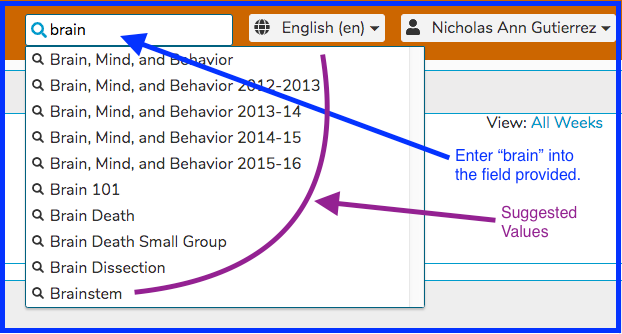
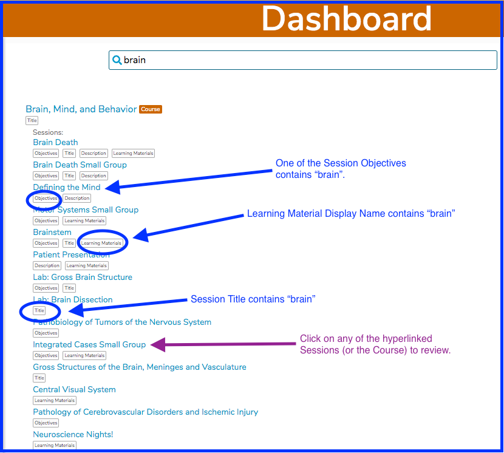

# Global Search

**NOTE**: Global Search is not currently available to users who are students and do not have any higher-level permissions or perform instructional or other non-learner functions in Ilios. This may change in the future.

The search box is initially located at the location specified above. If fewer than three characters are entered, the search will not be performed. The search box will move down to a more central location once a search has been successfully performed. Refer to [Search Results](https://iliosproject.gitbook.io/ilios-user-guide/dashboard/search#search-results).

The search provides content search to users with heightened privileges (non-students) across the curricula at your institution. Access beyond read-only for search returns is determined by individual permissions for each user account.

An entered search term will query across a broad array of areas within Ilios. These currently include:

* Course Title
* Course Objectives
* Course Learning Material Title
* Course Learning Material Description and Metadata
* Course Vocabulary Terms
* Course MeSH Terms
* Session Title
* Session Description
* Session Objectives
* Session Learning Material Title
* Session Learning Material Description and Metadata
* Session Vocabulary Terms
* Session MeSH Terms

Results are labeled according to the location of the match and listed with internal weighting to provide the most relevant results first.\
\
After performing a search, all of the areas listed above are scanned for matches. Suggestions are also provided.

### Performing a Search

To search for anything related to "brain", enter that into the search field provided. A list of suggested refinements ("Suggested Values") appear below the search box. Any of those can be utilized by clicking directly onto it.

To perform the full search (which we will do in this example), press the "Enter" key on the keyboard to perform the search.

### Search Results

### Show More

Search Results are grouped by Course, and then by Session. In the case above, the top three sessions that match (in order of match accuracy) are displayed. Clicking the "**Show More**" link, which appears at below the first three results for each Course, will open up and show the rest of the sessions within that course that match. For example, after the first "**Show More**" link located under the session link for "Defining the Mind", the screen now displays the rest of the sessions in the course called "Brain, Mind, and Behavior".

**NOTE:** This functionality is not available for students at this time.

### Filter Results

Once a search has been performed using the Global Search functionality, the results can be further refined (filtered). The following shows two types of filtering that can be done here.

#### Filter By School

#### Filter By Year&#x20;

Use of one or both of the filters shown above will change the result set to only include the values which meet the selected specifications.&#x20;
