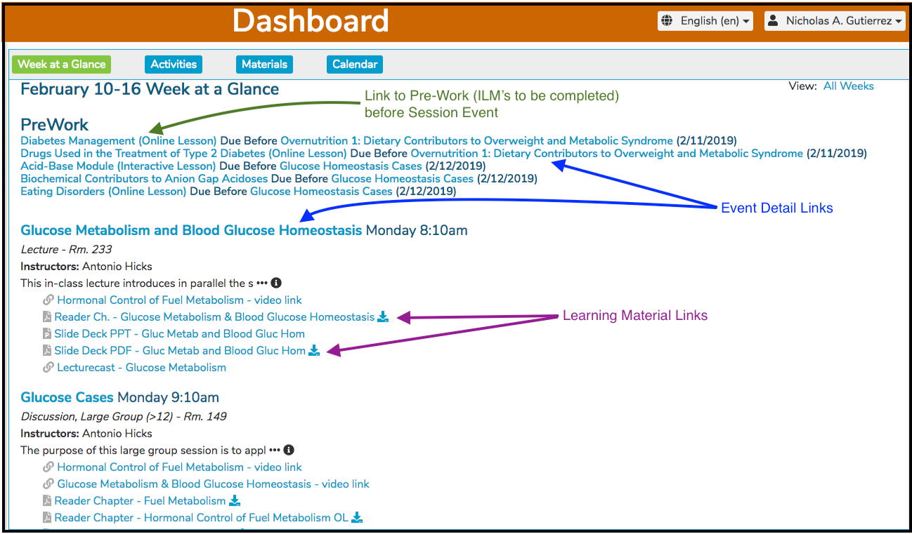
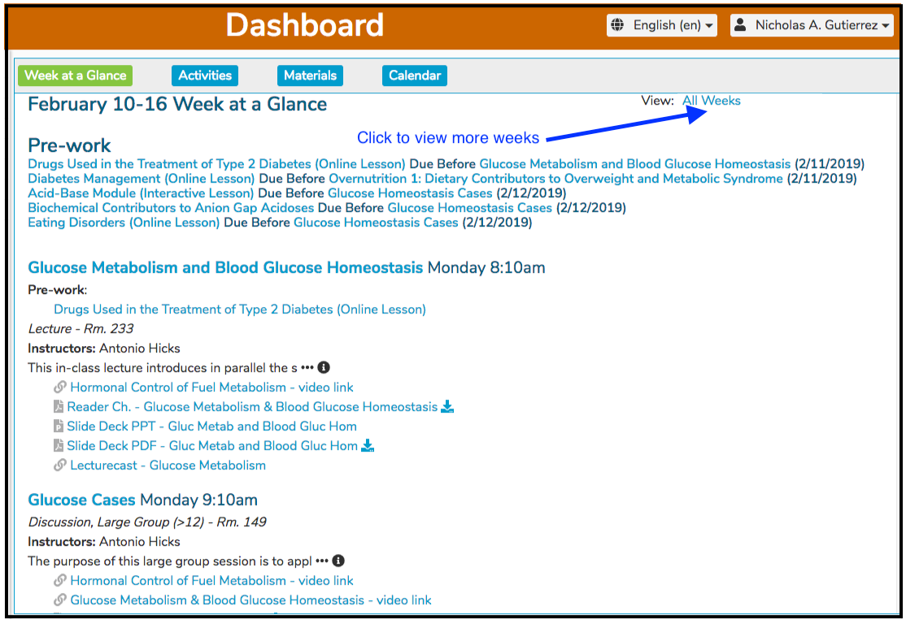
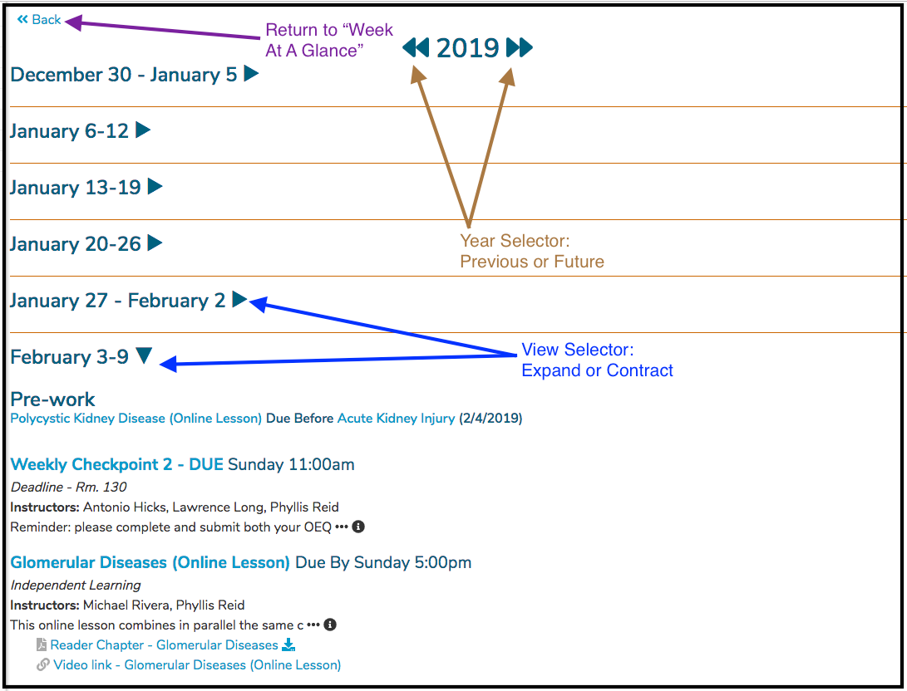
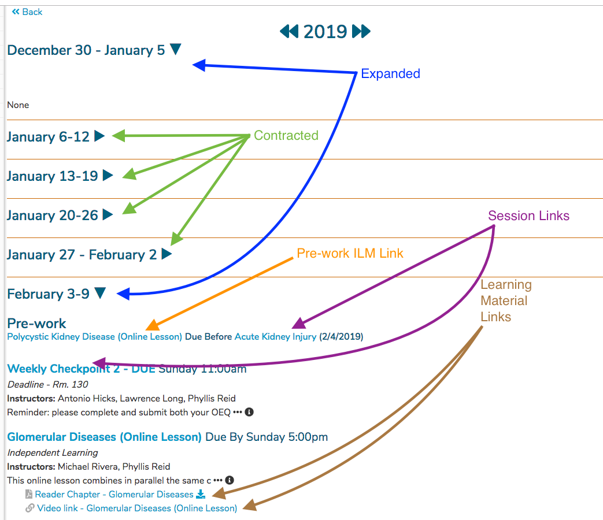

# Week At A Glance

Week At A Glance has proven to be a very useful feature in to Ilios. It is the default when a user logs in. As shown below, there are links available for [Event Details](https://iliosproject.gitbook.io/ilios-user-guide/dashboard/event-detail-view) and Learning Materials. A scroll bar will be displayed if the information does not all fit on the screen.

**Pre-work**: This section appears at the top of the Week At A Glance screen. If a student has Independent Learning Modules assigned to them that have been linked to upcoming Session Offerings that pertain to their schedule, these are listed at the top of the screen. They are ordered by the date / time of the upcoming Offerings. This is designed to make it easier for students to plan their approach towards tackling these pre-requisites before arriving in class.

In situations where linked ILM's are assigned, the user can navigate to either the ILM that needs to be completed before the scheduled Offering or to the Event Detail screen of the Offering itself. Standard ILM's which have a Due Date will show up on the Week At A Glance displaying the associated Due Date. This type of ILM is **NOT** provided its own area. The ILM's are ordered with the rest of the student's Offerings in ascending chronological date and time order.

## All Weeks

Another great feature of Ilios is that you can review any week's activity, whether it is in the future or the past. This also allows the user to refer to Learning activities that occurred or will occur in any week of any year that the user chooses to select. To open this functionality, click as shown in the screen shot below. The link's caption has been changed to simply "All Weeks".

After clicking "Last Week / Next Week / All Weeks" \(since renamed to "All Weeks"\), the screen and feature links are displayed as shown below.

Any number of weeks can be expanded or contracted to show or hide all details of the events taking place in that week. This is demonstrated below. The links to Learning Materials and Session Details are also highlighted in the screen shot.

