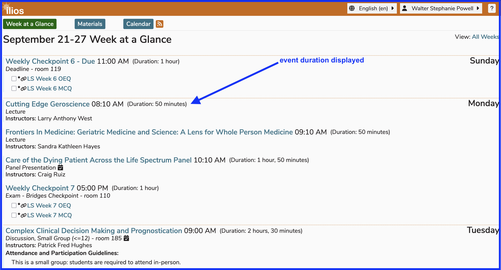
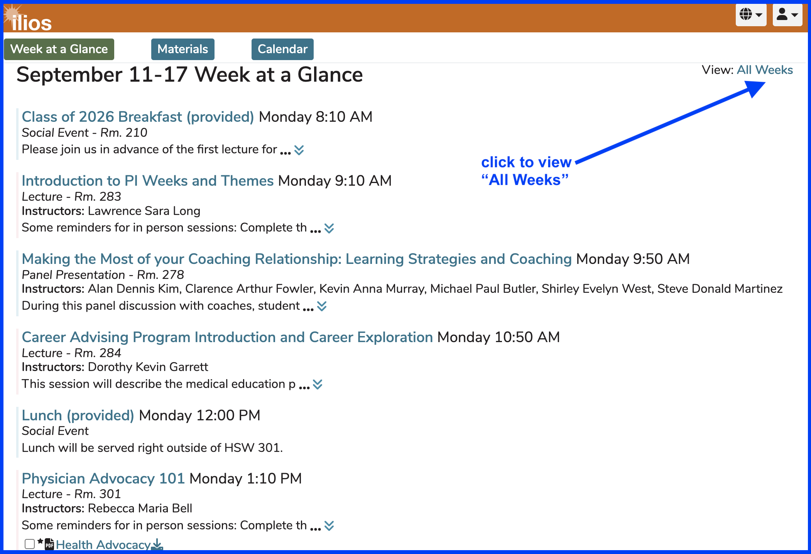
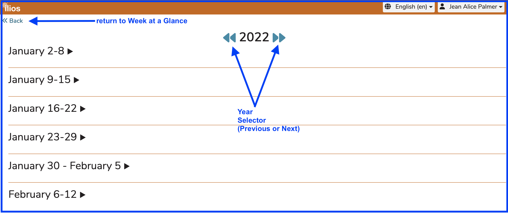
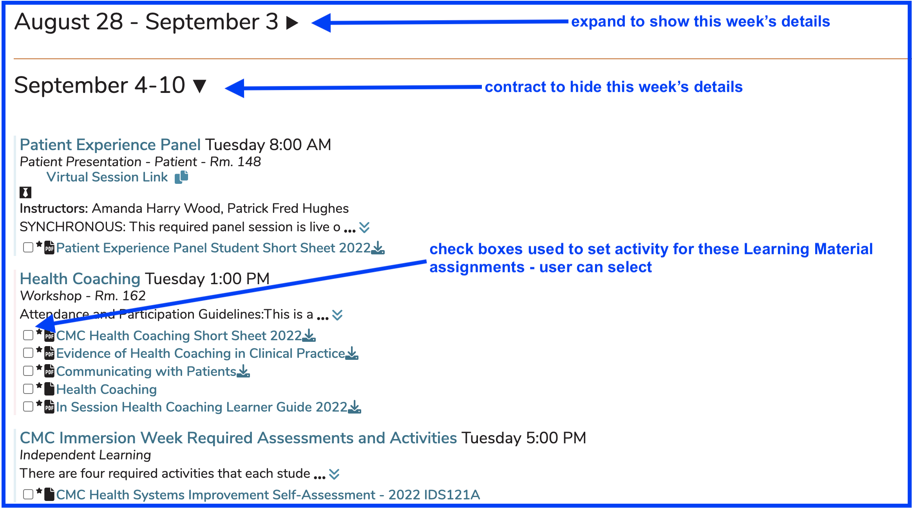

# Week at a Glance

This view gives students the detailed information they will need to navigate the current week. This includes all of the offerings they should be attending along with all of the learning materials associated with these offerings. Independent Learning Modules (asynchronous learning activities) are also included.

This is the default when a user logs in. As shown [below](https://iliosproject.gitbook.io/ilios-user-guide/dashboard/week-at-a-glance#week-at-a-glance-displayed), there are [Event Detail](https://iliosproject.gitbook.io/ilios-user-guide/dashboard/event-detail-view) links along with top-level navigation button links to [Materials](https://iliosproject.gitbook.io/ilios-user-guide/dashboard/materials-view) and [Calendar](https://iliosproject.gitbook.io/ilios-user-guide/dashboard/calendar-view). Links to [Learning Material Activity Check Boxes](https://iliosproject.gitbook.io/ilios-user-guide/dashboard/event-detail-view#learning-material-activity-check-boxes) (for ILM's) or direct access to the check boxes are also available here on Week at a Glance. Like always, a scroll bar will be displayed if the information does not fit on the screen.

**NOTE**: Week at a Glance (WaaG) is not designed as a complete and full calendar. It contains confirmed learning activities the learner will be facing that week. To access other weeks in a similarly formatted view, [All Weeks](https://iliosproject.gitbook.io/ilios-user-guide/dashboard/week-at-a-glance#all-weeks) can be accessed. Events that are set to a status of "Scheduled", which don't contain session specific information and event scheduling are **NOT** displayed on Week at a Glance. They are available on "Calendar" view.

## Linked ILM Work

ILM's that have been linked to an upcoming session are included as shown below in Week at a Glance. They are displayed similarly in Event Detail. The linked Session icon is shown below. Learning Materials associated with these session can be selected as completed or in process. The caveat is that this must be done by following the link to associated ILM.

<figure>
  
  <figcaption>
    
Linked Activities

  </figcaption>
</figure>

In situations where linked ILM's are assigned, the user can navigate to either the ILM that needs to be completed before the scheduled Offering or to the Event Detail screen of the Offering itself. Standard ILM's which have a Due Date will show up on the Week At A Glance displaying the associated Due Date. The ILM's are ordered with the rest of the student's Offerings in ascending chronological date and time order.

### Progress-Tracking Check Boxes

These personal progress check boxes are included to help students determine which Learning Material activities they have already addressed. These are persistent and will retain the value (state) selected by the student any time Ilios is accessed. This is private and not shared or accessed by anyone but the learner themselves. Items which are part of linked ILM modules will display with a slightly lighter grey appearance. These require a further click-thru to the module itself for update.

### Check Box States

**Not Started (default)** 

  <figure>
    
      <figcaption>
      
not started yet

      </figcaption>
  </figure>

**In Progress (first click)**

  <figure>
    
      <figcaption>
      
working on it

      </figcaption>
  </figure>

**Completed (second click)**

  <figure>
    
      <figcaption>
      
done

      </figcaption>
  </figure>

### Week at a Glance - Displayed

<figure>

  <figcaption>
    
Week at a Glance (Student View)

  </figcaption>
</figure>

## All Weeks

Another great feature of Ilios is that you can review any week's activity, whether it is in the future or has occurred in the past. To access this functionality, click as shown in the screen shot below.

<figure>

  <figcaption>
    
All Weeks (Starting Point)

  </figcaption>
</figure>

After clicking "All Weeks", the screen and feature links are displayed as shown below. Even though there are no learning activities for the logged-in student at the beginning of the year, the top part of the screen is shown for navigational purposes.

<figure>

  <figcaption>
    
All Weeks (top)

  </figcaption>
</figure>

The user will always be routed to the current week, which will be in expanded view by default, along with the previous and following weeks. Weeks in Ilios run from Sunday to Saturday.

Any number of weeks can be expanded or contracted to show or hide all details of the events taking place in that week. This is demonstrated below. The links to Learning Materials and Session Details are also highlighted in the screen shot.

<figure>

  <figcaption>
    
All Weeks (user routed to current week)

  </figcaption>
</figure>
