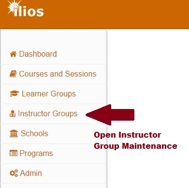
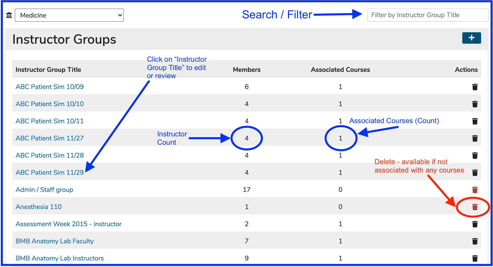

# Instructor Groups

It is possible to create an Instructor Group within Ilios that will assign a group of Instructors to a curricular event. Anyone who is a member of that group will be considered an Instructor for the session events assigned.

The Instructor Groups module in Ilios allows for the creation of reusable and trackable sets of instructors that can be associated to course/session activity. The groups are populated from the existing directory of instructors, and can be modified and added to as needed. An instructor may be associated with any number of instructor groups, or none at all. Instructors and instructor groups are associated with course content at the offering level for each session \(session offering\(s\)\).

Instructors who are not already in the directory provided should typically be added via the administrative user tools.

### Quick Links

* [Add Instructor Group](https://iliosproject.gitbook.io/ilios-user-guide/instructor-groups/add-instructor-group)
* [Edit Instructor Group](https://iliosproject.gitbook.io/ilios-user-guide/instructor-groups/edit-instructor-group)

## Instructor Group Maintenance

To access this functionality, click on the Instructor Groups menu item from the flyout menu as shown below.

This is the screen that appears \(see comments\).

