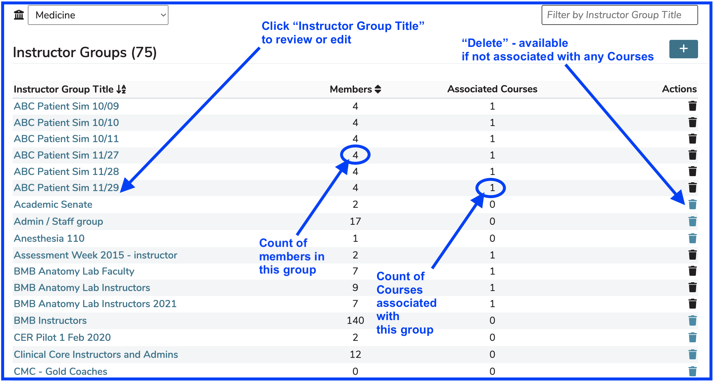

# Instructor Groups

The Instructor Groups module in Ilios allows for the creation of reusable and trackable sets of instructors that can be associated to course/session activity. The groups are populated from the existing directory of active Ilios users, and can be modified and added to as needed. An instructor may be associated with any number of instructor groups, or none at all. Instructors and instructor groups are associated with course content at the offering level for each session (session offering(s)) or they can be attached to Independent Learning Modules (ILM's).

**NOTE:** Instructor Groups persist throughout the years. There is no need to "rollover" an Instructor Group. They can be used in any available year. Basically, they exist in perpetuity. In this way, they differ from Learner Groups.

## Quick Links

* [Add Instructor Group](https://iliosproject.gitbook.io/ilios-user-guide/instructor-groups/add-instructor-group)
* [Edit Instructor Group](https://iliosproject.gitbook.io/ilios-user-guide/instructor-groups/edit-instructor-group)
* [Delete Instructor Group](https://iliosproject.gitbook.io/ilios-user-guide/instructor-groups/delete-instructor-group)

## Navigate to Instructor Groups

To access this functionality, click on the Instructor Groups menu item from the flyout menu as shown below.

<figure>
    
    <figcaption>
        
flyout menu -  go to Instructor Group maintenance
        

    </figcaption>
</figure>

This is the screen that appears (see image comments for details). These Instructor Groups can be sorted by "Instructor Group Title" or by "Members" (member count). There is also a text box available in the upper right which allows for filter by text string search. A school switcher is also available for the rare administrative users that have advanced privileges over more than one school.

<figure>
    
    <figcaption>
        
Instructor group list with details
        

    </figcaption>
</figure>
