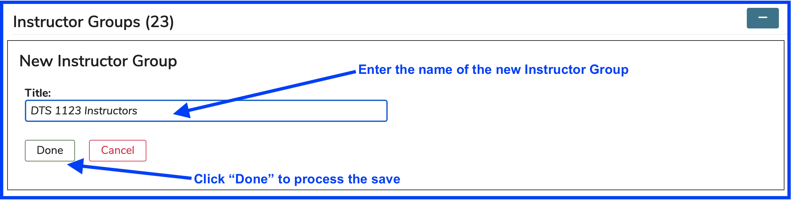
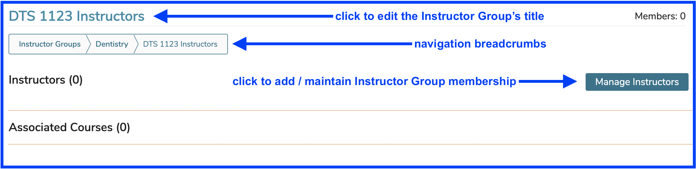
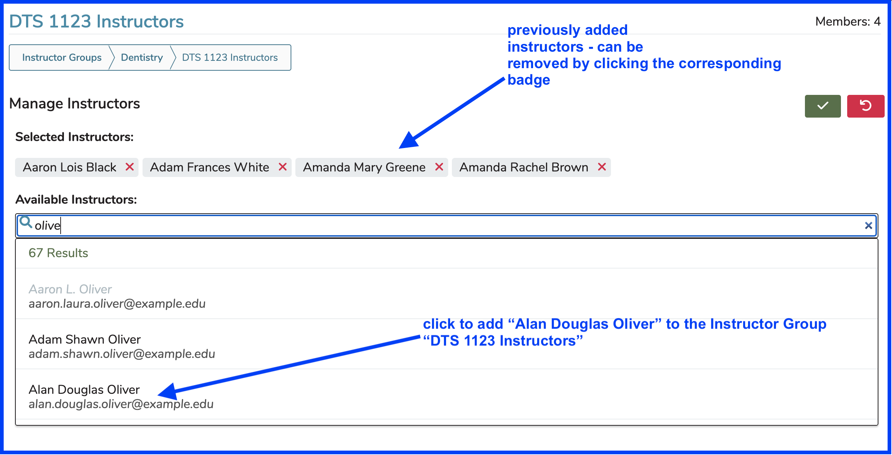
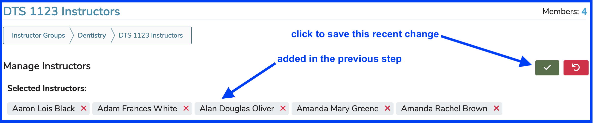
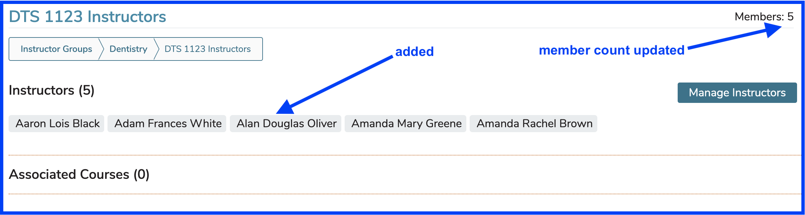

# Add Instructor Group

Click the (+) icon as shown below to start the process of adding an Instructor Group.

<figure><figcaption></figcaption></figure>

After clicking the Add button as shown above, enter the name of the new Instructor Group and Save (or Cancel) as shown below.

<figure><figcaption>
Add Instructor Group
</figcaption></figure>

The new Instructor Group gets added as shown above. A confirmation link is provided. This can be used to load up the new Instructor Group with Instructors or to change its name. The Instructor Group is also available by performing a search for its title. It appears with all of the other Instructor Groups for the School as soon as the Save event is processed.

<figure><figcaption>
New Instructor Group - after save
</figcaption></figure>

After clicking the link as shown above ...

<figure><figcaption>
New Instructor Group - selected
</figcaption></figure>

Instructors who have already been added to the Group appear as badges. They can be removed easily by simply clicking anywhere on the corresponding badge.

#### Add Instructor(s)

<figure><figcaption></figcaption></figure>

Following the steps outlined above, the screen changes as shown below.

<figure><figcaption>
Instructor Group - pre-save
</figcaption></figure>

After saving as shown above ...

<figure><figcaption>
Instructor Group - post-save
</figcaption></figure>

\
