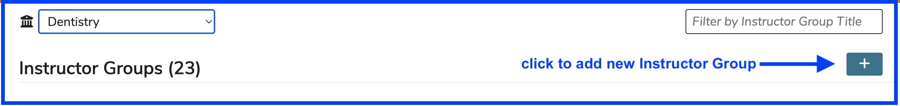
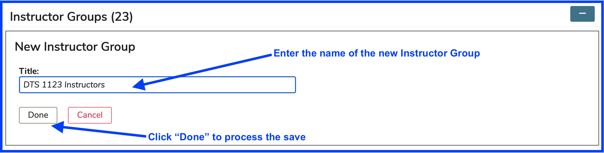
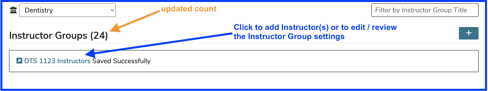
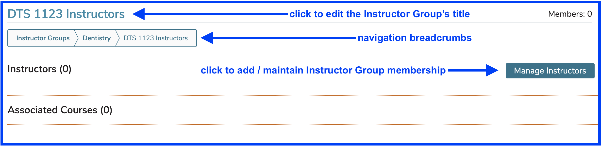
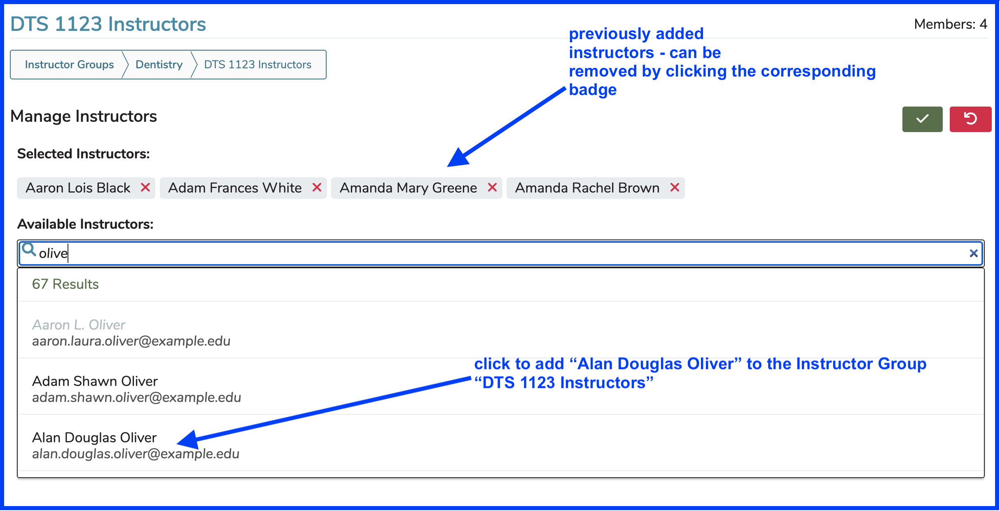
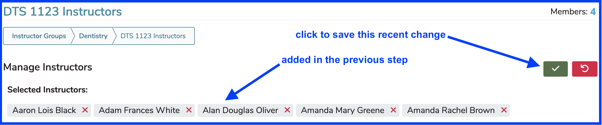
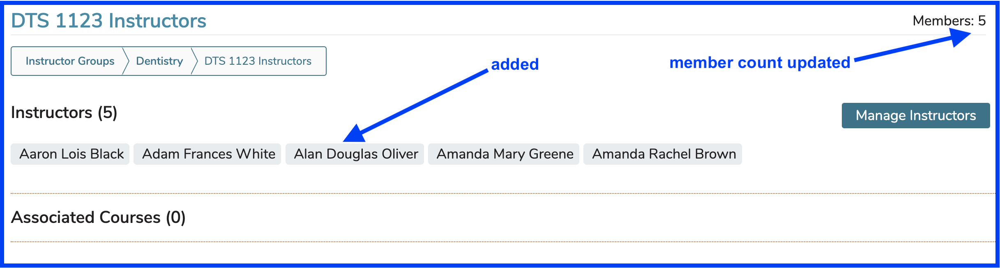

# Add Instructor Group

Click the (+) icon as shown below to start the process of adding an Instructor Group. It is necessary to select a school for the instructor group. They are assigned at the school level.

<figure>
    
    <figcaption>
        
 start add instructor group process

    </figcaption>
</figure>

After clicking the Add button as shown above, enter the name of the new Instructor Group and Save (or Cancel) as shown below.

<figure>
    
    <figcaption>
        
enter name

    </figcaption>
</figure>

The new instructor group gets added as shown above. A confirmation link is provided. This can be used to load up the new instructor group with instructors or to change its name. The instructor group is also available by performing a search for its title. It appears with all of the other instructor groups pertaining to the selected school as soon as the Save event is processed.

<figure>
    
    <figcaption>
        
after save

    </figcaption>
</figure>

After clicking the link as shown above ...

<figure>
    
    <figcaption>
        
new instructor group - selected

    </figcaption>
</figure>

For the sake of demonstration, instructors have been added to the newly created instructor group and appear as badges. They can be removed easily by simply clicking anywhere on the corresponding badge.

## Add Instructor(s)

<figure>
    
    <figcaption>
        
add instructors

    </figcaption>
</figure>

Following the steps outlined above, the screen changes as shown below.

<figure>
    
    <figcaption>
        
updates shown

    </figcaption>
</figure>

After saving as shown above ...

<figure>
    
    <figcaption>
        
instructor group - updated

    </figcaption>
</figure>

\
