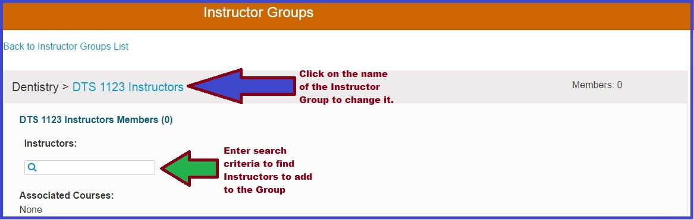

# Add Instructor Group

Click the \(+\) icon as shown below to start the process of adding an Instructor Group.

After clicking the Add button as shown above, enter the name of the new Instructor Group and Save \(or Cancel\) as shown below.

The new Instructor Group gets added as shown above. A confirmation link is provided. This can be used to load up the new Instructor Group with Instructors or to change its name.

After clicking the link ...

Instructors who have already been added to the Group appear as badges. They can be removed easily by simply clicking anywhere on the corresponding badge.

