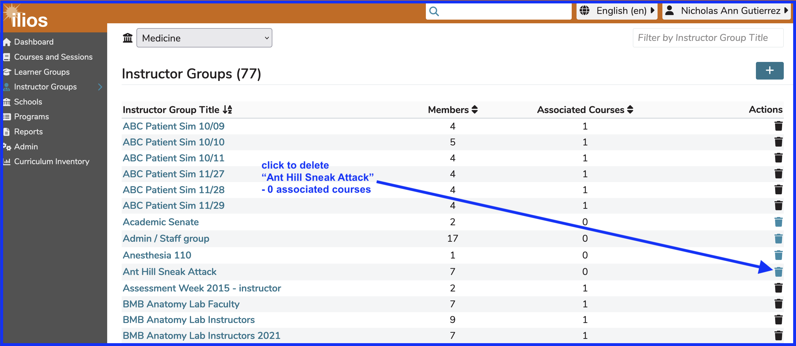
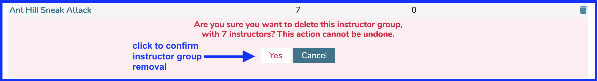

## Delete Instructor Group

Instructors Groups that have not been attached to offerings, asynchronous learning activities (ILM's) or used elswhere in the system can be easily removed using the interface.

Similar to the removal of learner groups, these groups can either be populated with members or empty. The key is that they have not been attached to events in the system.

The trash can button will be enabled and ready to use when this is the case. This is in accordance with behavior throughout the application.

<figure>
    
    <figcaption>
        
select instructor group to remove
        

    </figcaption>
</figure>

After clicking as shown above, the confirmation dialog and message appear as follows.

<figure>
    
    <figcaption>
        
confirm instructor group deletion
        

    </figcaption>
</figure>

The list will now refresh with one instructor group no longer present - the one we just deleted.
