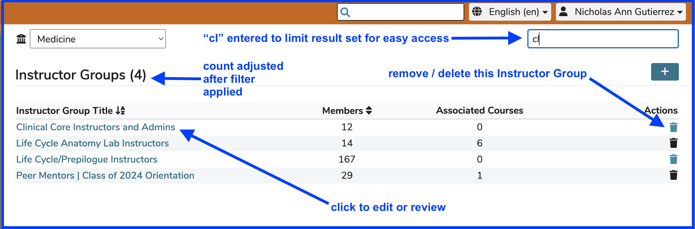
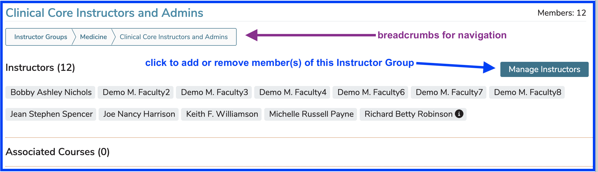
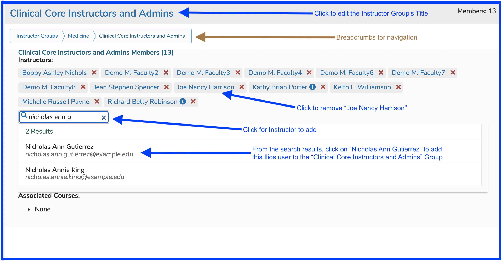
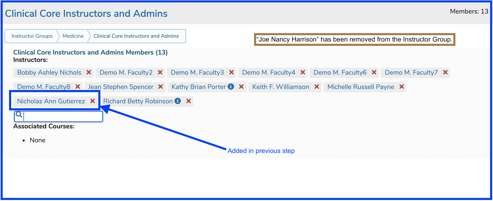

# Edit Instructor Group

To edit Instructor Group membership (or the name of the group itself), click on the name of the group to be edited. It may be helpful to perform a Search for the Instructor Group's title if there are many in existence.

<figure><figcaption></figcaption></figure>

**NOTE**: The trash can icon is enabled in the screen shot above because this Instructor Group has not been associated with any teaching activities. The "Associated Courses" field provides this information. If that number is greater than zero, the trash can delete button will be disabled.

Once the Instructor Group has been selected, the screen appears as shown below. The arrows point to actions that can be performed.

<figure><figcaption>
Instructor Group - (view only mode)
</figcaption></figure>

In order to edit the name of the Instructor Group, click on the name link itself to perform that operation. The "Manage Instructors" button must be clicked in order to activate the functionality required to add or remove Instructor Group membership.

After clicking "Manage Instructors" ...

After performing the steps outlined above, the changes made take effect immediately. The screen is updated to reflect these changes in real-time.

