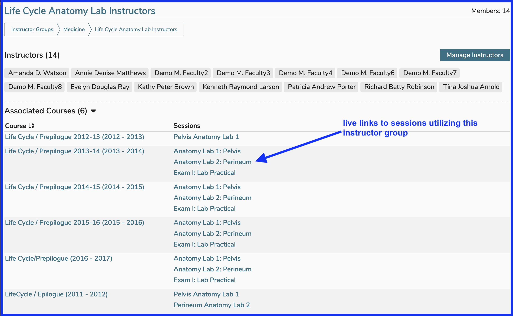

# Edit Instructor Group

To edit Instructor Group membership (or the name of the group itself), click on the name of the group to be edited. It may be helpful to perform a Search for the Instructor Group's title if there are many in existence.

<figure>
    
    <figcaption>
        
click to edit

    </figcaption>
</figure>

## Remove Instructor Group

If the trash can icon is enabled as it is in the screen shot above, the instrutor group can be deleted / removed from the system. This occurs because this Instructor Group has not been associated with any teaching activities. The "Associated Courses" field, the count of which gets updated when this instructor group is used in session offerings or ILM's, provides this information. If that number is greater than zero, the trash can delete button will be disabled.

## Sort Options

The instructor group listing can be sorted by either "Instructor Group Title" - the default sort order (A-Z) or by "Associated Courses", which can be useful when you would like to review the instructor groups with more usage in courses and sessions.

## Associated Courses 

This includes sessions and links to the referenced sessions. This will take the usage to Courses and Sessions to perform any maintenance or review of the session and its offerings.

An example of this, showing a different insttuctor group with "Associated Courses" in expanded mode, is shown below. 

<figure>
    
    <figcaption>
        
instructor group detail

    </figcaption>
</figure>

## Select Instructor Group

Once the Instructor Group has been selected, the screen appears as shown below. The arrows point to actions that can be performed.

<figure>
    
    <figcaption>
        
editing options shown

    </figcaption>
</figure>

In order to edit the name of the Instructor Group, click on the name link itself to perform that operation. The "Manage Instructors" button must be clicked in order to activate the functionality required to add or remove Instructor Group membership.

After clicking "Manage Instructors" ...

<figure>
    
    <figcaption>
        
editing options activated

    </figcaption>
</figure>

After performing the steps outlined above and saving, the changes made take effect immediately. The screen is updated to reflect these changes in real-time.

<figure>
    
    <figcaption>
        
Changes - saved

    </figcaption>
</figure>
