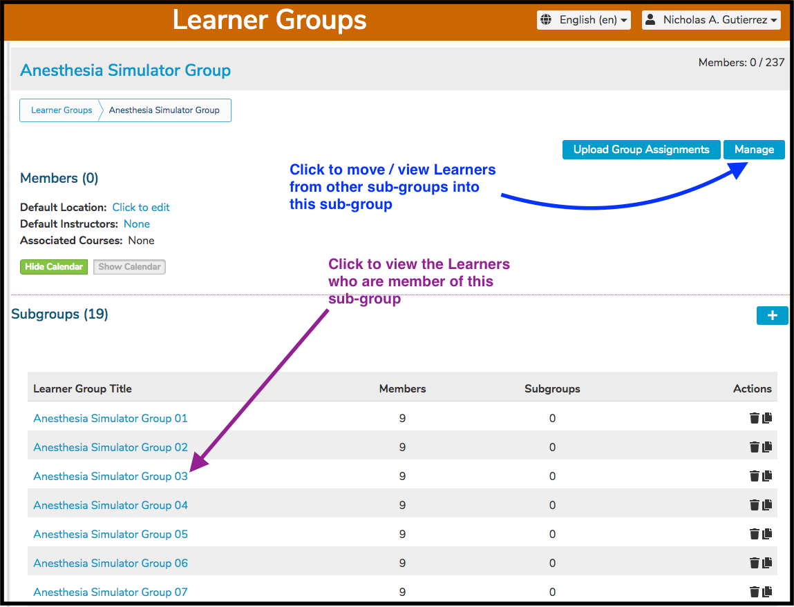
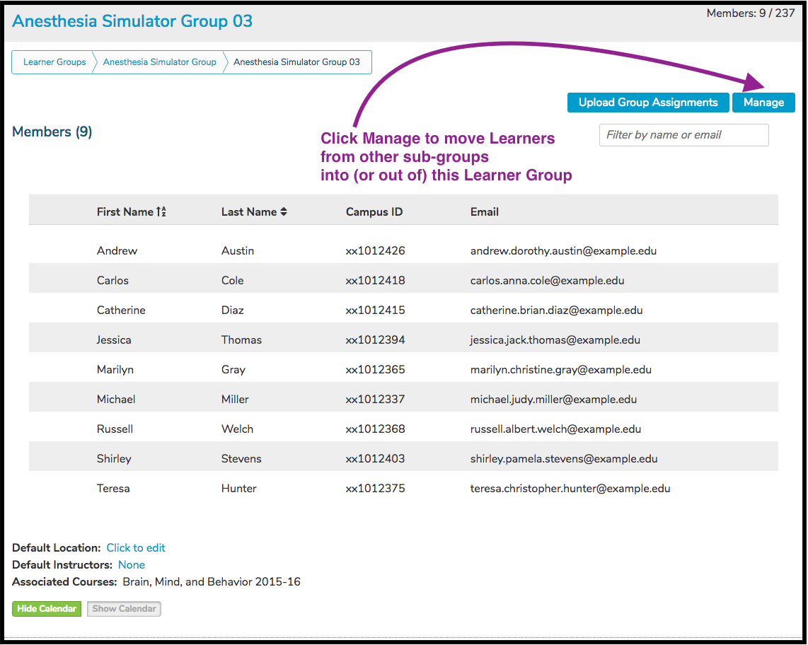
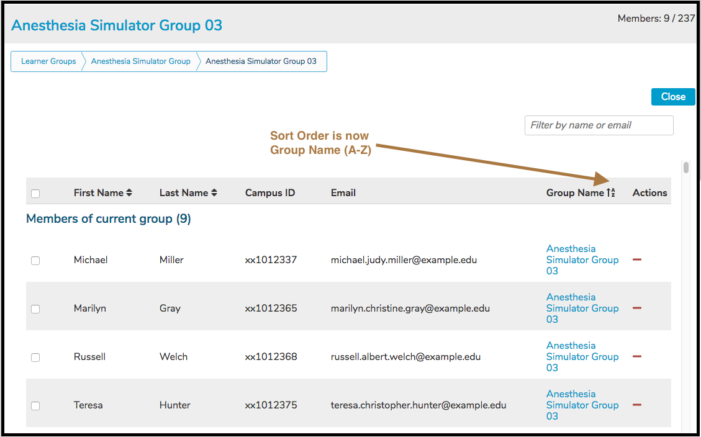
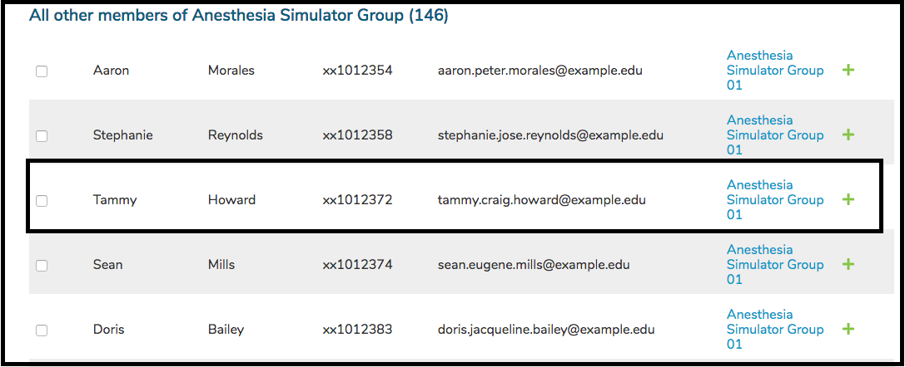

# Learner Groups

This denotes a collection of Learners which can be associated with Sessions, Offerings, and Independent Learning Modules.

## Attributes

* **Title** - The name of the Learner Group - Text field description of the Learner Group. This can be modified by clicking on the linked title and making edits to the text in-line right there and saving using a mouse-click confirmation or "return" or "enter" on the keyboard.
* **Breadcrumbs** - Breadcrumbs are provided next in the vertical flow of the page. These provide navigation to parent (or grandparent) groups and the relative location of the selected group.
* [**Needs Accommodation**](https://iliosproject.gitbook.io/ilios-user-guide/learner-groups/learner-group-defaults#needs-accommodation) - Toggled when one or more learners in any given group (or sub group) need accommodation or additional resources in order to participate successfully in virtual learning events.
* [**Default Location**](https://iliosproject.gitbook.io/ilios-user-guide/learner-groups/learner-group-defaults#default-location) - Shown in display as the location of record for activities to which a group is associated when no other location is identified. Just as with Default Instructor, this only applies to Small Group Offerings.
* [**Default Virtual Learning Link**](https://iliosproject.gitbook.io/ilios-user-guide/learner-groups/learner-group-defaults#default-virtual-learning-link) - Entered manually or pasted in from an external source such as Zoom. This default virtual learning link behaves in the same manner as Default Instructor(s) and Default Location. It will only apply to Small Group Offerings.
* **Associated Courses** - Read-only listing of all courses and sessions (and active links) that have used this learner group in session offerings or ILM's. Screen shots of contracted and expanded views of this view are shown below.

* [**Default Instructor(s)**](https://iliosproject.gitbook.io/ilios-user-guide/learner-groups/learner-group-defaults#default-instructor-s) - Selected from the existing population that has been entered into Ilios by campus systems and manual entry. Shown in display as the instructor of record for activities to which a group is associated when no other instructors are identified. This only applies to Small Group Offerings. Individual Offerings do **NOT** get the default instructor from the Learner Group.
* **Members** - Following the flow of the page, the next area is a listing of all the members of this learner group. Covered in other place are the instructions on how to manage learner group membership.
* **Subgroups** - Subgroups are listed next. 
* **Cohort Members NOT Assigned** - This listing displays all of the members of the cohort that have not been added to this group or subgroup. They can be added by clicking the "plus" button to the right of the screen or done in bulk my mutiple selection and button click to add.

## Other Options

* **Hide Calendar / Show Calendar -** These buttons are used to switch on or off the Learner Group Calendar, which displays all learning activities to which this Learner Group has been attached. This Calendar is displayed using the weekly view. It can scrolled forward or backwards in time.
* **Show events for all subgroups -** This toggles on or off whether the Learner Group Calendar displays events for any and all subgroups of this Learner Group. This only applies if the calendar is being displayed.

Learner Group Management is a method of tagging, grouping and managing the learners who are attached to curricular activity in Ilios. This module allows for the association of sets of learners to specific content, and makes it possible to report out on those associations. The demographic details of individual learners are not tracked within Ilios.

The groups in Ilios are persistent data containers, which exist outside the context of a course or session. Each Group belongs to a specific program cohort; the members of that cohort may be added or removed from any of its groups. A Cohort is created each time a new Program Year is added to a Program; essentially, this means that for any year in which a Program is active and a Program Year has been added in Ilios, there is automatically created a Learner Cohort for “The Class of 20XX”. A group may be attached any number of times to any number of sessions in any number of courses. Groups may also be subdivided into any number of smaller groups. Groups are associated to courses and sessions via calendared offerings of sessions and independent learning units; the groups of any learner cohort will be available for association to a session once that cohort is attached to the course in question.

## Hierarchical by Design

**Learner Groups are Hierarchical**

A key to the Group Management system is to understand the hierarchical nature of the groups, and the way it relates to Programs of study.

For each entering class of learners, a unique container is created in the system. This is the learner (All Class) “Cohort”. It is populated via the user management console with data from the campus systems to identify individual learners. Typically, learners should not be added manually to the Ilios system; all registered students should be available from the feed provided in the administrative tools. However, if learners need to be manually entered into Ilios, the process is similar to that for Instructor Groups. Learners who are not already listed as part of a cohort in the directory provided may be added manually, either individually or via csv-formatted spreadsheet using the “Upload Group Assignments” link. Students by default are assigned into a primary cohort for tracking, but may (as may any Ilios user) be assigned into any number of “Secondary Cohorts”, to allow for multi-year and program assignment, transfer from one cohort to another, and other various needs. Initial primary and secondary assignment is handled via the [Admin](https://iliosproject.gitbook.io/ilios-user-guide/admin) console.

From a particular cohort, any number of “top level” groups can be created. Each top level group may be created either with the entire population of the cohort, or as an empty group which may be manually populated. You may create any number of top level groups. Individual members of any group may be removed (“unassigned”) at any time. In this way, top level groups may be modified to contain specific subsets of the total cohort population, and lower level sub-groups may be managed as necessary. Each student in a Class cohort may belong to multiple top level groups.

Once a top level group is created, it may be partitioned into any number of smaller groups (sub-groups or designations), which will then be seen as members of the top level group. Those smaller groups may also be divided into smaller partitions. A group may have as members both individuals and groups --- all remain members of the same “top level” group.

A learner may only appear once within the tree of a single top level group.

Note that when selecting learners for addition to a group, disabled user names are displayed in grey, to allow for historical tracking and management. They still may be added or removed from groups, but the users will not have access unless their accounts are re-enabled.

Only one group may be edited at a time. To open a different group for editing, either a parallel group in the same level of the hierarchy, or a group in a higher level of the hierarchy, click on the “open this group” link; this will close the group currently available for edit, and open the selected group for editing and management.

## How to Access

Clicking on the flyout menu item "Learner Groups" brings up the Learner Group Management tool. The tasks that can be accomplished using this tool are spelled out in individual sections below. You can create, modify, and delete Learner Groups. Membership in Learner Groups is maintained here as well. This determines which students are attached to which offerings. Learner Groups are attached to Offerings. This is key to understanding how Ilios works.

## Group Centric

It is important to note that Learner Group Management is now very much about the group itself. The key is to navigate to whichever group (or sub group) needs modification (Learners added or removed mainly). Once you navigate to the correct group or sub group (the breadcrumbs are helpful with this), you can then search and find any Learner(s) in the Cohort who can be easily added to the group to which you have navigated. Please refer to the Tasks section below for links to specific actions that can be taken.

## Tasks

* [New Learner Group](https://iliosproject.gitbook.io/ilios-user-guide/learner-groups/new-learner-group)
* [Filter for Group](https://iliosproject.gitbook.io/ilios-user-guide/learner-groups/edit-group-properties#filter-for-group)
* [Edit Group Attributes](https://iliosproject.gitbook.io/ilios-user-guide/learner-groups/edit-group-properties#edit-group-attributes)
* [Edit Group Membership](https://iliosproject.gitbook.io/ilios-user-guide/learner-groups/edit-group-membership)
* [Add Single Sub Group](https://iliosproject.gitbook.io/ilios-user-guide/learner-groups/sub-groups#add-single-sub-group)
* [Add Multiple Sub Groups](https://iliosproject.gitbook.io/ilios-user-guide/learner-groups/sub-groups#add-multiple-sub-groups)
* [Add Individual Learner to Group](https://iliosproject.gitbook.io/ilios-user-guide/learner-groups/edit-group-membership#add-individual-learner-to-group)
* [Add Multiple Learners to Group](https://iliosproject.gitbook.io/ilios-user-guide/learner-groups/edit-group-membership#add-multiple-learners-to-group)
* [Removing One Or More Learners From Group](https://iliosproject.gitbook.io/ilios-user-guide/learner-groups/edit-group-membership#removing-one-or-more-learners-from-group)
* [Delete Learner Group](https://iliosproject.gitbook.io/ilios-user-guide/learner-groups/remove-learner-group)

## View Membership

There is a way in Ilios to easily review Learner Group, specifically, Sub Group membership. To do this, open up Learner Group Management by clicking the "Learner Groups" menu item from the Ilios flyout menu. Then, choose a Group which has Sub Groups the membership of which you would like to verify. For the sake of this example, we have chosen "Anesthesia Simulator Group", which has 38 Subgroups and a total of 164 members - distributed amongst the subgroups.

Once the Learner Group has been selected by clicking on the Learner Group link, the screen appears as shown below. We are at the higher level of "Anesthesia Simulator Group". To review the members of any of the sub groups, the sub group should be selected. If you are already in one of the sub groups, clicking Manage at that level will allow members to be viewed and moved around between the sub groups.

The Learner Group called "Anesthesia Sub 3" has been selected and accessed as shown above. The members of the subgroup are listed in read-only mode. To maintain "Anesthesia Sub 3" and allowing the removal or addition of Learners from this (and the other) sub-groups underneath "Anesthesia Simulator Group", click "Manage" as shown below.

To ensure learners have been properly assigned to the correct subgroups, scroll down and review the membership.

**NOTE**: The default sort order is by First Name >> Ascending. Once in "Manage" mode, you may want to switch the sort order to Group Name >> Ascending to help with maintenance and review. This is done by clicking on the header itself, which will update the sort order on both the parent group and subgroup member listings.

Scroll down further and you can see the Learners who are in other "Anesthesia Simulator Group" sub-groups. What can be done here?

* Learners can be moved out of "Anesthesia Sub 3" and placed back up into the Cohort.
* Learners can be moved into "Anesthesia Sub 3" from any of the other "Anesthesia Simulator Group" subgroups or from the Cohort itself - learners not in any of the subgroups.

After scrolling down past the members of "Anesthesia Sub 3", the Learners in the other sub-groups are available for selection to be added INTO "Anesthesia Sub 3".

As highlighted below, the Learner "Tammy Howard" can be moved into "Anesthesia Sub 3" by either clicking the green "+" or by clicking the check box to the left of her first name "Tammy" and then later by confirming the move.

