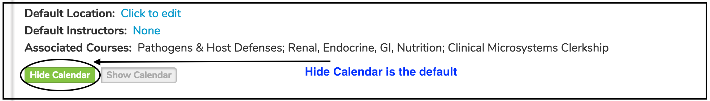
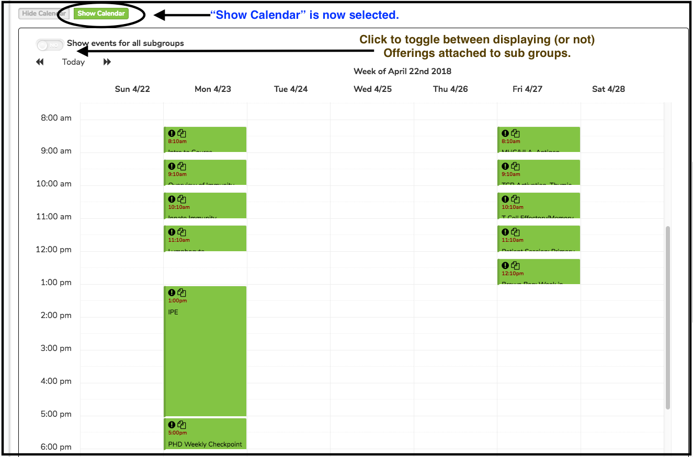

# Learner Group Calendar

Below is an updated screen shot of a Learner Group in Ilios. It is easy to display all of the offerings for any selected Learner Group (with options to display sub groups). Initially, as shown below, "Hide Calendar" is selected. Even before setting the option to display the Calendar, it is easy to review Courses that are using this Learner Group in session offerings. The "**Associated Courses:**" field provides a quick review of that information.

In the screen shot below, the "Show Calendar" option has been selected and all of the Offerings to which this Learner Group is attached are shown in the Calendar.

