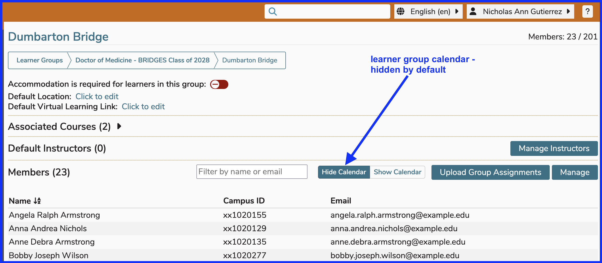
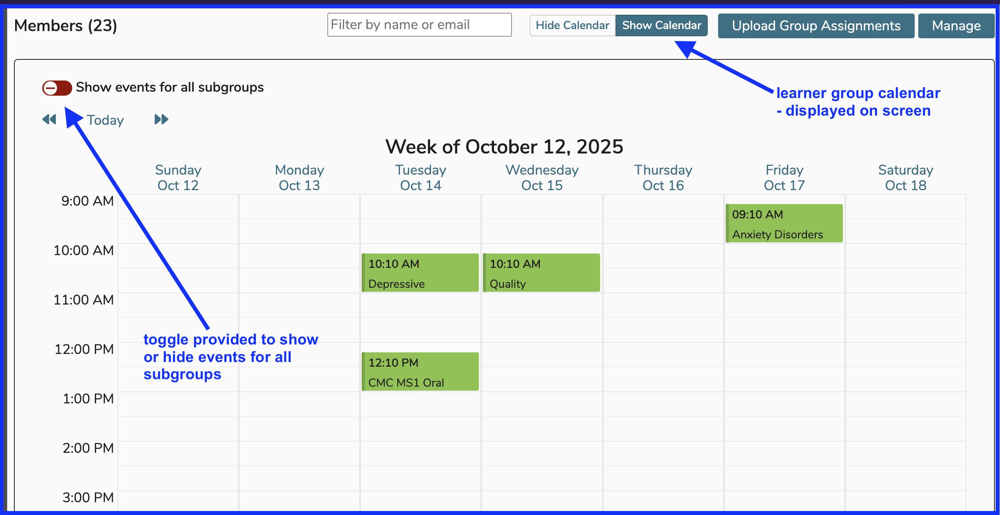

# Learner Group Calendar

Below is an updated screen shot of a Learner Group in Ilios. It is easy to display all of the offerings for any selected Learner Group (with options to display events pertaining to all sub groups). Initially, as shown below, "Hide Calendar" is selected. Even before setting the option to display the Calendar, it is easy to review Courses that are using this Learner Group in session offerings. The "**Associated Courses:**" field provides an expandable list of all courses (and sessions) with links provided to access and review this learner group's relationships to offerings and ILM's in the system.

In the screen shot below, the "Show Calendar" option has been selected and all of the offerings to which this Learner Group is attached are shown in the Calendar. The toggle provided to show events for all subgroups can be set in the "Yes" position by clicking on it to slide it. This would display offerings for any learner groups subsidiary to the current group in addition to showning all offerings for the current group.

