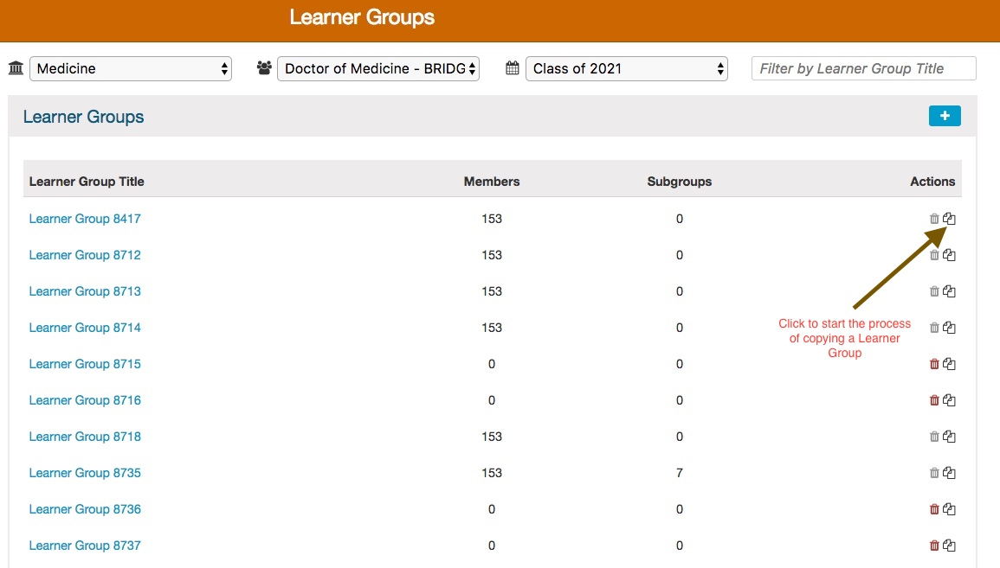
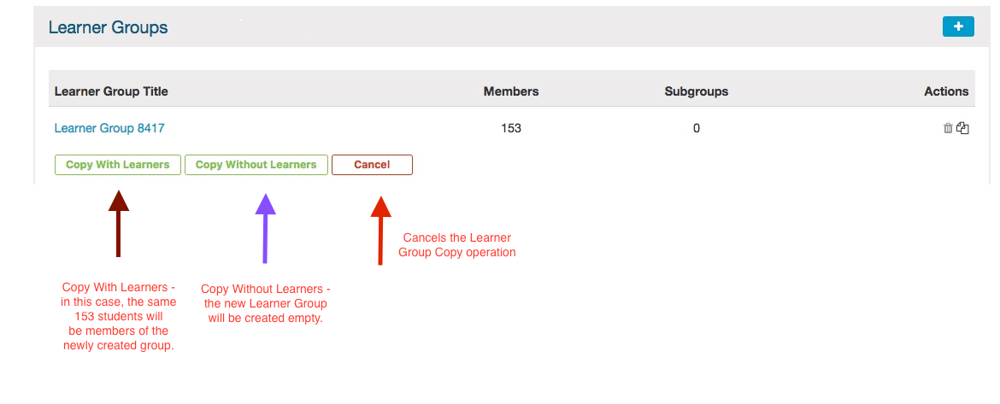
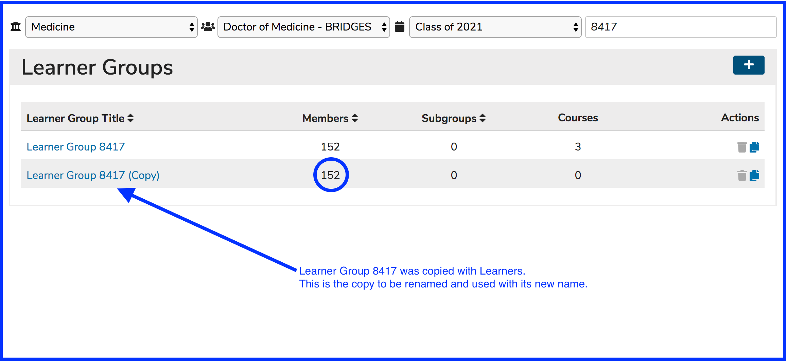

# Copy Learner Group

Ilios allows Learner Groups to be copied either with or without the learners. It is a very handy addition to Ilios.

To copy a Learner Group, the "Copy" icon \(the same icon is also used in Copy Session\) is used to start the process. The arrow in the screen shot below shows this icon within Learner Groups.

Once the Copy button has been pressed \(as shown above\), you can either create a copy of an existing group \(and any sub groups\) with the same Learner membership as the one you are copying or empty to be populated later.

The newly created group will initially be named the same as the predecessor + \(Copy\). If you copy "Learner Group A", the new group will be called "Learner Group A \(Copy\)". After the new group is created, it may be useful to change the group's name to something else completely.

For reference ... [**Edit Learner Group**](https://iliosproject.gitbook.io/ilios-user-guide/learner-groups/edit-group-properties#edit-group-attributes)\*\*\*\*

