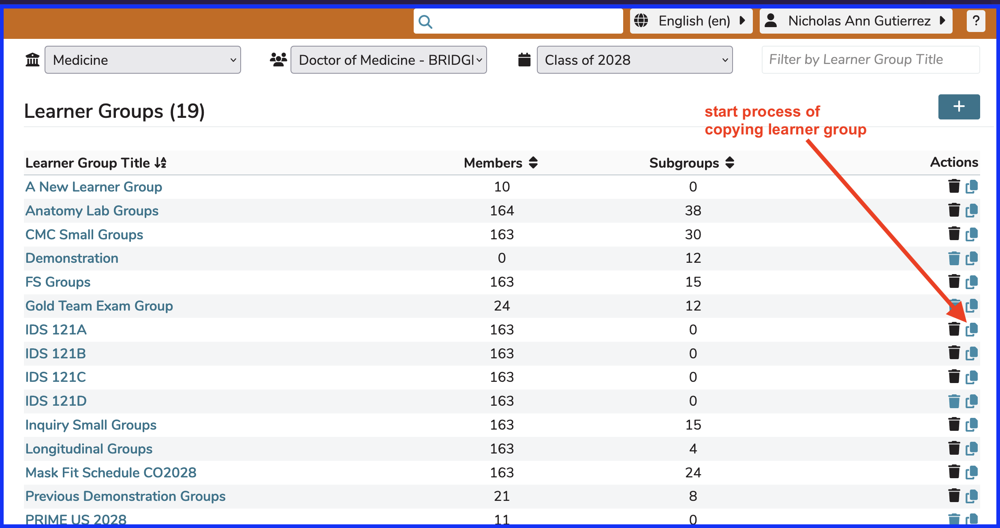

# Copy Learner Group

Ilios allows Learner Groups to be copied either with or without the learners. 

To copy a Learner Group, the "Copy" icon (the same icon is also used in Copy Session) is used to start the process. The arrow in the screen shot below shows this icon within Learner Groups. Any learner group can be copied. None of the associated education activities assigned to the original group are copied. The members of the learner group can be copied, but only will be, if the "Copy with Learners" option is selected.

Once the Copy button has been pressed (as shown above), you can either create a copy of an existing group (and any sub groups) with the same learner membership as the one you are copying or create the new learner group empty to be populated later. This option is shown below.

The learner group being copied here is called "IDS 121A". Per the instructions below, the new group (post-copy) will be called "IDS 121A (copy)". It can be changed after creation.

The newly created group will initially be named the same as the predecessor + (Copy). If you copy "Learner Group A", the new group will be called "Learner Group A (Copy)". After the new group is created, it may be useful to change the group's name to something else completely. In this example, the option to copy with learners was selected.

A splash screen briefly presents itself indicating work is in progress. Afterwards, the newly copied learner group appears as shown below with a confirmation message appearing at the top of the learner group list.

For reference ... [**Edit Learner Group**](https://iliosproject.gitbook.io/ilios-user-guide/learner-groups/edit-group-properties#edit-group-attributes)

